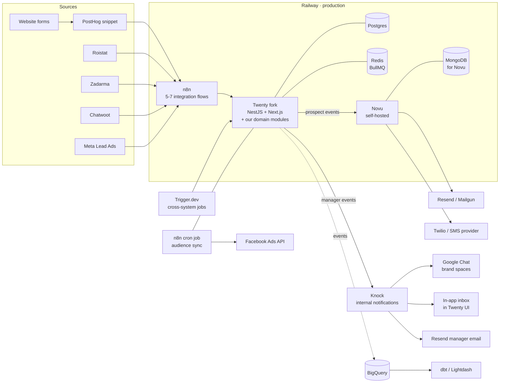

# Architecture

## The picture

## Two layers, hard boundary

| Layer | Owns | Doesn't own |
|---|---|---|
| **n8n** (Railway) | Webhook reception, source-format normalization, brand-specific alert routing, SaaS bridges, audience-to-Facebook cron | Domain logic, state, transactions |
| **Twenty fork** (Railway) | Data persistence, UI, auth, state machine, identity resolution, smart routing, sequences engine, SLA scanner, transactional integrity | External webhook reception, cross-system orchestration |

The "domain service" as a separate process **does not exist**. Our domain code lives as NestJS modules added to our Twenty fork, sharing the same Postgres connection, same Redis, same deploy. Multi-step writes are real database transactions.

## Supporting services

| Service | Purpose | Why separate |
|---|---|---|
| **Novu** | External (prospect-facing) notifications — email, SMS | OSS, multichannel, self-hosted on Railway alongside Twenty + n8n |
| **Knock** | Internal (manager-facing) notifications — in-app, Google Chat, daily digest | Mature in-app inbox; sops team already knows it; manager UX matters |
| **Trigger.dev** | Cross-system cron jobs (Zadarma extension sync, BigQuery reconciliation, Facebook audience push) | Code-first, version-controlled, runs outside Twenty's perimeter |
| **Roistat** | Call attribution layer (DID substitution + UTM/visit_id capture) | Third-party SaaS; we consume its webhook |
| **Chatwoot** (self-hosted) | Omnichannel inbox for prospect DMs | Self-hosted, we own the conversations |
| **PostHog** | Web analytics + identity graph | Already in use, unchanged |
| **BigQuery + dbt + Lightdash** | Analytical warehouse | Already in use, unchanged; consumes Twenty's event stream |

## The fork is our codebase, but we don't rush to delete

Twenty is the starting kit — 80% of a CRM ready to ship. We shape it into the ENSO real-estate CRM through additions and, where their assumptions fight ours, modifications. Implications:

- Domain code lands as NestJS modules in-tree (`enso/routing/`, `enso/sequences/`, etc.)
- Our 7 first-class objects added as proper entities; Twenty's existing `Person` / `Company` / `Task` modules extended rather than replaced
- UI customizations (real-estate-specific screens) added alongside Twenty's generic ones
- Twenty's modules kept 1:1 with upstream initially — we explore what's useful before deciding to delete
- Upstream merges tractable for ~6-9 months while we stay close to their main branch

Discipline rules in [stack](./stack#modification-discipline) — add what we need, modify what fights us in practice, defer deletion until usage proves something unneeded.

## Production from day 1, no staging

Current Attio + n8n production is in a building phase with no active users. We're not migrating off a live system — we're building the system that goes live. No parallel build, no fan-out, no shadow comparison.

Cutover is just: point webhooks at the new n8n on Railway, decommission old n8n on Elestio, archive Attio. Three days of work at the end.

## Stable contracts between layers

- **External → n8n**: vendor webhook payloads (HMAC or shared secrets per source)
- **n8n → Twenty**: Twenty's GraphQL / REST API
- **Twenty → Novu / Knock**: HTTP triggers with event names + subscriber IDs
- **Twenty → BigQuery**: event stream via Fivetran webhooks (existing contract preserved)
- **Trigger.dev → Twenty**: Twenty's API
- **Twenty → Roistat / 1C / Customer.io's Facebook**: outbound HTTP per service

Each contract is one direction at a time, with one purpose, with idempotency keys where it matters. Swap any component without touching the others — same insight you named.

## Where each system concern lives

| Concern | Layer | Module |
|---|---|---|
| Webhook reception + normalization | n8n | per-source flow |
| Identity resolution (E.164 phone, dedup) | Twenty fork | `identity-resolution` NestJS module |
| Deal stage transitions + validation + rollback | Twenty fork | `deal-state-machine` module |
| Smart routing (availability × project × round-robin) + claim-or-reroute timer | Twenty fork | `routing` module + BullMQ |
| Sequences engine (template-driven tasks) | Twenty fork | `sequences` module |
| SLA scanner + overdue warnings | Twenty fork | BullMQ cron + `sla` module |
| Pipeline state lifecycle (active/stalled/deferred) | Twenty fork | `deal-state-machine` |
| First-touch attribution | Twenty fork | enforced at deal creation in `deals` module |
| Real-time UI updates | Twenty fork | LISTEN/NOTIFY + Twenty's existing realtime |
| External notification delivery | Novu | workflows; triggered from Twenty |
| Internal notification delivery | Knock | workflows; triggered from Twenty |
| Audience sync to Facebook Ads | n8n | dedicated cron flow |
| Daily Zadarma extension sync | Trigger.dev | scheduled job |
| BigQuery event emission | Twenty fork | event listener publishing to Fivetran webhook |

## What the analytical half consumes

Unchanged from today. Twenty fires events on every state change → existing Fivetran webhook → BigQuery `raw_crm_events` → dbt → Lightdash / Metabase / Evidence.

The dbt staging layer needs adjustment (event shape differs from Attio's schema dumps), but the warehouse, the marts, the dashboards all stay.
