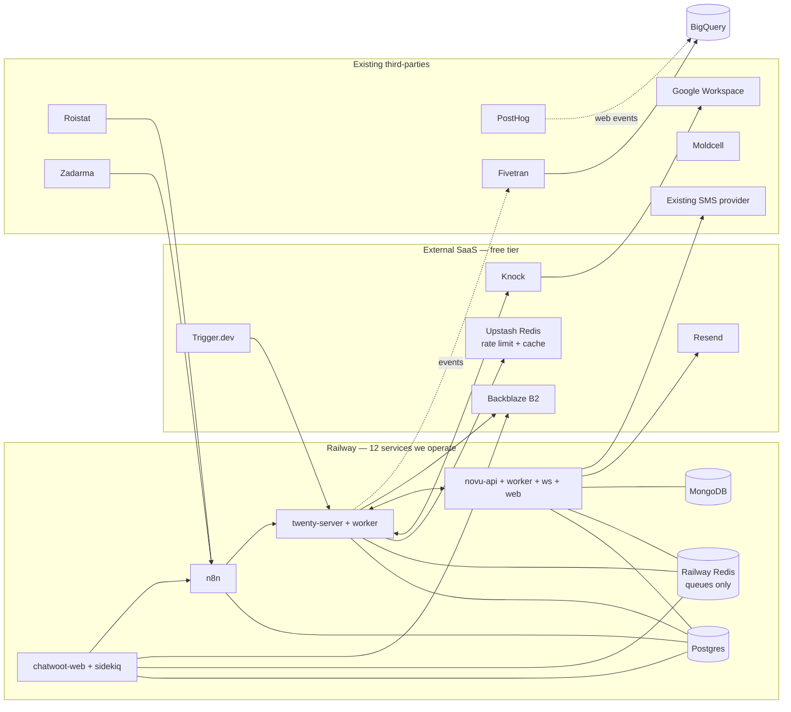

# Deployment topology

13 services on Railway, 4 external SaaS (all on free tier), 9 third-parties already in use.

## Railway — services we operate (13)

### App containers (9)

| # | Service | What | RAM | Notes |
|---|---|---|---|---|
| 1 | `twenty-server` | NestJS API + Next.js frontend | 1-2 GB | Main CRM |
| 2 | `twenty-worker` | BullMQ background jobs (SLA scanner, routing timer, etc.) | 512 MB - 1 GB | Separate process from server |
| 3 | `n8n` | Integration flows | 512 MB - 1 GB | 5-7 small flows |
| 4 | `novu-api` | Notification triggers + workflow runtime | 512 MB | |
| 5 | `novu-worker` | Background job processor for notifications | 512 MB | |
| 6 | `novu-ws` | WebSocket server for in-app realtime | 256 MB | |
| 7 | `novu-web` | Admin dashboard UI (templates, workflow editor) | 256 MB | Optional |
| 8 | `chatwoot-web` | Rails app | 1 GB | |
| 9 | `chatwoot-sidekiq` | Background jobs | 512 MB - 1 GB | |

### Data services (3)

| # | Service | Used by |
|---|---|---|
| 10 | `postgres` (one instance, four databases: twenty, n8n, novu, chatwoot) | All four apps |
| 11 | `redis` (one instance, namespaced — for queues only) | Twenty BullMQ, Chatwoot Sidekiq, Novu queue |
| 12 | `mongodb` | Novu (its only awkward dep) |

Object storage is Backblaze B2 (external, see below) — not a Railway service.

Rate limiting + lightweight cache uses the **existing Upstash Redis** (free tier, already provisioned for n8n's dedup work today). Twenty's webhook intake endpoints use `@upstash/ratelimit` against it. Doesn't displace Railway Redis — queue workloads stay on Railway because Upstash's free tier (10k commands/day) can't handle BullMQ polling.

→ Real count: **12 Railway services**.

## External SaaS — free tier strategy

Each one is on free tier. Volume projections show we stay there comfortably through v1 and first growth.

| # | Service | What it does | Free tier | ENSO v1 expected | Headroom |
|---|---|---|---|---|---|
| 1 | **Knock** | Internal notifications (in-app inbox, Google Chat, daily digest email) | 10,000 events/month | ~900-6,000/month | 40-90% headroom |
| 2 | **Trigger.dev** | Cross-system cron jobs (Zadarma extension sync, Facebook audience sync if not in n8n, BigQuery reconciliation) | 5,000 task runs/month | ~150-300/month | 94% headroom |
| 3 | **Resend** | Email transport behind Novu + Knock | 3,000 emails/month, 100/day | ~90-1,000/month | 67-97% headroom |
| 4 | **Backblaze B2** | S3-compatible object storage for attachments | 10 GB storage + 1 GB egress/day forever | A few GB year 1 | ~50-70% headroom; effectively $0 |
| 5 | **Upstash Redis** (already provisioned) | Rate limiting + lightweight cache (NOT queues — those stay on Railway Redis) | 10,000 commands/day, 256 MB | ~few hundred-thousand commands/day | Fits free tier; would otherwise be ~$0 anyway |

### Backblaze B2 details

S3-compatible object storage. Same API as AWS S3, ~4× cheaper on storage and ~9× cheaper on egress.

**What it stores**:
- Twenty deal attachments (PDFs, floor plans, contracts uploaded by managers)
- Chatwoot conversation attachments (prospect images, voice notes)
- Novu template assets (header images, branded graphics)
- NOT call recordings — Zadarma signs time-limited URLs to its own storage; we just reference them

**Cost**:
- Storage: $6/TB/month ($0.006/GB)
- Egress: $10/TB ($0.01/GB)
- Uploads: free
- Free tier: 10 GB + 1 GB egress/day, forever

**For ENSO**: expected first-year volume is a few GB → **effectively $0**. Even at 100 GB it's ~$0.60/month.

**Configured via standard S3 env vars** in each app:
```env
S3_ENDPOINT=https://s3.eu-central-003.backblazeb2.com
S3_BUCKET=enso-crm
S3_KEY=<from B2 application key>
S3_SECRET=<from B2 application key>
```

Twenty, Chatwoot, and Novu all support arbitrary S3-compatible endpoints — no code changes.

### What pushes us off free tier (and what to do)

| Trigger | Service hit | Action |
|---|---|---|
| Lifecycle cadences (v2) start sending broadcast emails to 1000+ prospects | Resend → past 3000/mo free | Upgrade to Resend $20/mo (50k emails) or move to Postmark / SES |
| Team scales to 20+ SDRs with high event activity | Knock → past 10k/mo free | Upgrade to Knock Starter ($X/mo) |
| Heavy reconciliation jobs add up | Trigger.dev → past 5k/mo free | Either upgrade or migrate some jobs to n8n cron |
| Attachments grow to multi-TB (unlikely) | Backblaze | Pay-as-you-go; still cheap |

None of these are v1 concerns.

## Email transport: Resend + Novu

Resend is a first-class Novu provider. Setup is one API key + DNS records (DKIM, SPF, DMARC) on a sending domain like `mail.enso.ro`. Resend handles:
- DKIM signing
- SPF alignment
- Bounce/complaint webhooks → Novu auto-marks subscribers
- Suppression list
- Deliverability monitoring

Send templates are authored in Novu's UI (or as code via `@novu/framework`); Resend just delivers.

## SMS transport

Not Twilio — using existing MD/RO SMS providers via webhook. Novu's SMS channel points at our existing provider's HTTP webhook. If the provider has a known API shape (e.g. MessageBird, Smsmode, local Moldovan operator), Novu likely has a built-in provider; otherwise the "Custom" provider calls any webhook URL.

## Third-party services already in use (9, no change)

| # | Service | What | Already paid |
|---|---|---|---|
| 1 | Google Workspace | Email + Chat (Knock pushes alerts to brand-specific Chat spaces) | yes |
| 2 | Roistat | Call tracking + ad attribution | yes |
| 3 | Zadarma | RO telephony provider | yes |
| 4 | Moldcell | MD telephony provider | yes |
| 5 | PostHog | Web analytics + identity graph | yes |
| 6 | Fivetran | Data sync to BigQuery | yes |
| 7 | Facebook Ads | Audience target (n8n pushes to) | yes |
| 8 | GitHub | Code + CI | yes |
| 9 | Sentry | Error tracking | yes |

## Analytical half (existing, untouched)

5 services in `modern-data-stack/`:
- BigQuery (Google Cloud)
- dbt (existing)
- Evidence on Railway (per `infra/evidence/Dockerfile`)
- Lightdash (existing)
- Metabase (existing)

## Cost summary

| Bucket | Monthly cost |
|---|---|
| Railway (12 services, conservative sizing) | ~$100-140 |
| Knock free | $0 |
| Trigger.dev free | $0 |
| Resend free | $0 |
| Backblaze B2 | $0 (within free tier) |
| **New external SaaS total** | **$0** |
| Existing third-parties (Google Workspace, Roistat, Zadarma, Moldcell, PostHog, Fivetran, Facebook, GitHub, Sentry) | Unchanged from today |
| **Grand total of NEW recurring cost** | **~$100-140/mo on Railway** |

Compared to current (Attio + Customer.io + Respond.io + Render + Elestio + Upstash): you're likely **flat or slightly cheaper**, with a meaningfully more capable stack.

## Topology diagram


