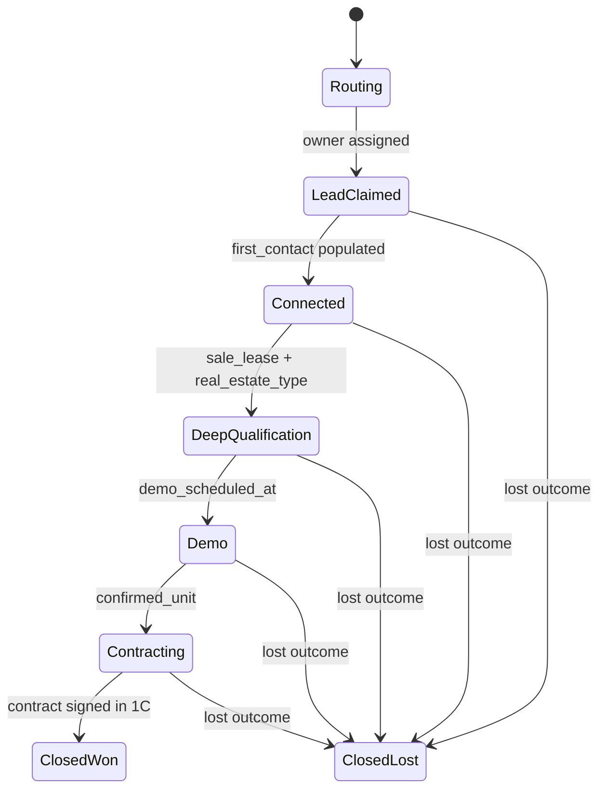

# Deals

The core object. One **open** deal per Person per project — dedup is person × project over non-closed deals with no time window; a closed deal lets a fresh inquiry open a new one (#9 resolved; see [systems/lead-pipeline](../systems/lead-pipeline)).

## Schema

```text
deals
├── id (uuid)
├── name (text) — e.g. "Call | +37379628432 | ARTIMA Business & Lifestyle"
├── project_id (fk → projects)
├── owner_user_id (fk → users, nullable until claimed)
├── stage (enum, see below)
├── pipeline_state (enum: active, deferred, stalled)
├── value_eur (numeric, nullable)
├── source (enum: form, call, social, lead_ad, manual)
├── created_from_activity_id (fk → activities)
├── first_contact_at (timestamptz, nullable)
├── first_contact_channel (enum: call, email, sms, whatsapp, viber, telegram, social)
├── created_at, updated_at, closed_at (nullable)
├── merged_into_id (fk → deals, nullable) — soft-delete via merge
└── notes (text)
```

## Stage enum (state machine)



### Stages

| Stage | Auto-advance trigger | Required fields to advance |
|---|---|---|
| `Routing` | — | — |
| `LeadClaimed` | owner assigned | — |
| `Connected` | `first_contact_at`, `first_contact_channel` set | `first_contact_at`, `first_contact_channel` |
| `DeepQualification` | qualification fields set | `sale_lease`, `real_estate_type` |
| `Demo` | demo scheduled | `demo_scheduled_at`, `demo_type` |
| `Contracting` | unit confirmed + manager pushes to CPQ | `deal_units` has role=confirmed |
| `ClosedWon` | 1C reports contract signed (webhook) | — |
| `ClosedLost` | manager sets lost reason | `lost_reason_id` |

→ Detailed transition logic in [systems/state-machine](../systems/state-machine).

## Pipeline state — the 2D model

Pipeline state is orthogonal to stage. It expresses *how the manager is engaging with the deal right now*, independent of where in the funnel it is.

| State | Meaning | Behavior |
|---|---|---|
| `active` | Manager is actively working it; next task due ≤ 2 weeks out | Counts in "My Active Deals" |
| `deferred` | Long-tail: client said "contact me in 3 months" | Out of active view; future task triggers re-entry |
| `stalled` | Manager working it but client not responding; not yet lost | Counts in escalation queue |

### Counters (computed, not stored)

The Attio schema stored `stall_count`, `deferred_count`, `reactivated_count` as text fields. In Postgres these come from `deal_state_history`:

```sql
CREATE VIEW deal_state_counters AS
SELECT
  deal_id,
  COUNT(*) FILTER (WHERE new_state = 'stalled') AS stall_count,
  COUNT(*) FILTER (WHERE new_state = 'deferred') AS deferred_count,
  COUNT(*) FILTER (WHERE new_state = 'active' AND old_state IN ('stalled','deferred')) AS reactivated_count,
  MAX(transitioned_at) FILTER (WHERE new_state = 'stalled') AS last_stalled_at,
  MAX(transitioned_at) FILTER (WHERE new_state = 'deferred') AS last_deferred_at
FROM deal_state_history
GROUP BY deal_id;
```

## Project matching — replaces the Initial/Proposed/Confirmed triad

Today: three separate fields on Deal (`initial_project_name/id`, `proposed_project_name/id`, `confirmed_project_name/id`) — 6 fields, decoupled name+ID per pair, only 3 select options per Name field, 5 per ID field, hardcoded JS lookup workflow to keep them in sync. AVENEW orphaned.

Rebuild: **one `project_id` FK on Deal** (the project the lead is *for*) + a `deal_units` table for unit-level interest evolution per [domains/projects-and-units](./projects-and-units).

The "initial project" concept (what the prospect asked for) lives on the original `activity_id` referenced by `deals.created_from_activity_id`. The "confirmed project" is just `deals.project_id` after it stops changing.

## Source attribution

```text
deals
├── first_utm_source, first_utm_medium, first_utm_campaign, first_utm_content, first_utm_term
├── first_traffic_type (enum: paid, organic, direct, social, email, referral)
├── first_landing_page
├── roistat_visit_id (text, nullable) — links to Roistat-side attribution
├── first_contact_channel
└── (all of the above frozen at deal creation, never updated)
```

These mirror the current "First UTM" denormalized fields. They're frozen at deal creation — even though the source activity might get updated, the deal's attribution is immutable.

→ Cross-reference in [systems/attribution](../systems/attribution).

## Merge — explicit, audited

Replaces Attio's `merge_the_deal` + `list_of_deals_for_merger` field-trigger workflow.

```text
deal_merges
├── id, primary_deal_id, secondary_deal_id
├── merged_by, merged_at
├── reason (text)
└── prior_secondary_snapshot (jsonb) — full secondary state for rollback
```

When merged:
- `deals.merged_into_id` set on secondary (soft-delete)
- Multi-value fields union'd to primary
- UTM fields concatenated with `' | '` where primary has none and secondary does
- All activities + tasks reassigned to primary
- Comment posted to primary's owner

Merge is reversible from snapshot for 30 days, then snapshot is purged.

## Cross-sale / additional sale

Current Attio has `Cross-Sale (Yes/No)` and `Deal Type (Primary Sale / Additional Sale)`. We keep:

```text
deals
├── deal_type (enum: primary_sale, additional_sale, cross_sale, lease, resale)
└── related_deal_id (fk → deals, nullable) — for "this is a cross-sale of deal X"
```

## Lost reasons — managed list, not free text

Today's `reasons_for_refusal` is multi-select with placeholder values `"Reason 1"`, `"Reason 2"` — never populated. The rebuild has:

```text
lost_reasons
├── id, code, label, sort_order
├── active (boolean)
└── allows_followup (boolean) — some reasons (e.g. "wrong number") can re-engage; others (e.g. "moved out of country") cannot

deal_lost_reasons (m:n)
├── deal_id, lost_reason_id, notes
```

Need to seed with the actual reasons sales uses. Asked in [open-questions](../open-questions).

## What we drop from Attio Deals

| Attio field | Why |
|---|---|
| 11 text timestamps (`timestamp_routing`, `timestamp_lead_claimed`, ...) | Replaced by `deal_state_history` with proper `timestamptz` |
| `stall_count`, `deferred_count`, `reactivated_count`, `routing_count` (all text) | Computed views |
| `deal_changes` (catch-all text) | Replaced by `deal_state_history` event log |
| `first_activity`, `last_activity` (URL text) | Replaced by relationship table |
| `initial_project_name`, `proposed_project_name`, `confirmed_project_name` + their ID twins | One `project_id` FK + `deal_units` table |
| Empty placeholder `list_of_deals_for_merger_5` | — |
| `respond_chat` URL | Replaced by `chatwoot_conversation_id` FK |

## What we add

- Real `deal_state_history` event log
- Proper enum types for stage, pipeline_state, source, deal_type
- `deal_units` for unit-level interest evolution
- `deal_merges` audit table
- `lost_reasons` managed list
- `closed_at` timestamp
- `value_eur` as a real currency type
