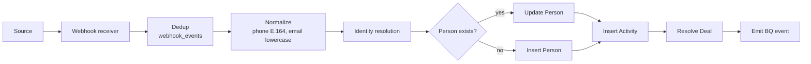

# Leads

A "Lead" is not a primary object in the CRM. It's a **state**: a Person who has triggered an inbound Activity and may or may not have a Deal yet. We track inbound events directly into the `activities` table and resolve identity → Person → maybe-Deal at intake.

## The intake spine



## Sources

| Source | Transport | Trigger event | Owner |
|---|---|---|---|
| Website form | HTTPS POST direct to CRM | `form_submitted` | CRM |
| Roistat (calls) | Roistat webhook (twice per call: start + end) | `call_started`, `call_ended` | Roistat → CRM |
| Zadarma (direct) | Zadarma webhook (notify_start/answer/end/record) | various | Zadarma → CRM |
| Meta Lead Ads | n8n facebookLeadAds trigger → CRM POST | `lead_ad_submitted` | n8n → CRM |
| Chatwoot | Chatwoot webhook on inbox events | `message_received`, `conversation_created` | Chatwoot → CRM |

## Webhook reception

Single endpoint per source, with HMAC verification where possible:

| Source | Auth | Notes |
|---|---|---|
| Roistat | None native — IP allowlist + path secret | Cron sweep to reconcile missed events |
| Zadarma | HMAC signature on signed responses; webhooks: shared secret in path | Use `notify_*` events |
| Meta Lead Ads | n8n handles Meta auth; we trust n8n via shared secret | Keep n8n as a translation layer to avoid Meta's auth complexity |
| Chatwoot | API token in header | Self-hosted, easy to rotate |
| Website form | HMAC signature using a per-site secret | Form sites embed signing in PostHog snippet |

Every webhook lands in `webhook_events(id, provider, external_id, received_at, raw_payload, dedup_key)` with `UNIQUE(provider, external_id)`. A worker pulls the queue and processes idempotently.

## Dedup at intake (replaces Upstash Redis)

```sql
INSERT INTO webhook_events (provider, external_id, raw_payload, dedup_key)
VALUES (...) ON CONFLICT (provider, external_id) DO NOTHING
RETURNING id;
```

If `RETURNING` is empty → duplicate, drop. Otherwise queue for processing.

For calls specifically (where Roistat fires twice + Zadarma sometimes echoes), use a `dedup_key` that includes a time-bucket (e.g. `phone:E164:rounded_to_10min`). The worker that consumes these events **waits 30 seconds before processing** to allow the second event from Roistat to arrive, then merges both into one Activity (analogous to today's 10-min Upstash TTL, but database-backed).

## Normalization

| Field | Rule |
|---|---|
| `phone` | Parse with libphonenumber, default region by call DID country (RO=`+40`, MD=`+373`). Store as E.164. Reject if unparseable. |
| `email` | Lowercase, trim. Reject obvious garbage (no `@`). |
| `name` | Trim, collapse whitespace. If empty, fall back to phone-as-name (matches today's behavior). |
| `language` | Normalize to ISO `ro` / `ru` / `en`. From form locale, social profile, or detected. |

## Identity resolution

Per request, the worker:

1. Queries `people` by `phone_e164` first, then `email_normalized`.
2. If 1 match → update that Person (merge fields per the merge ruleset).
3. If 0 matches → insert new Person.
4. If >1 matches → take the **oldest**, queue an async merge job for the others (see [systems/identity-resolution](../systems/identity-resolution)).

This matches today's behavior — the inline part of `Merging Contacts` + the at-intake people-query in `Forms/Calls/Social Workflow`.

## Activity insert

Every inbound event becomes one `activities` row. Typed by `kind`:

| `kind` | Required fields | Notes |
|---|---|---|
| `form_submission` | `host`, `form_id`, `submitted_payload`, `utm_*` | Project derived from `host` map |
| `incoming_call` | `caller_e164`, `callee_did`, `status`, `duration_s`, `recording_url?` | Project derived from Roistat custom_fields |
| `social_message` | `platform`, `external_thread_id`, `body`, `chatwoot_conversation_id` | Project derived from inbox |
| `lead_ad` | `form_id`, `payload`, `utm_*` | Project derived from form name or campaign |
| `appointment_booked` | `event_id`, `start_at`, `attendee_*` | iCal source |

UTM attribution stored on `activities` (the event), not on Deal. Deal-level attribution is computed from `first activity` (see [systems/attribution](../systems/attribution)).

## Resolving to a Deal

Once Activity is inserted, the worker resolves to a Deal:

```text
SELECT id FROM deals WHERE EXISTS (
  SELECT 1 FROM deal_people WHERE deal_id = deals.id AND person_id = $1
) AND deals.project_id = $2
  AND deals.stage NOT IN ('Closed Won', 'Closed Lost')
```

(Dedup is **person × project over OPEN deals, with no time window** — #9 resolved.
This matches legacy Attio's "ever exists" (the `Creating a Deals` workflow matched
person × project against *all* their deals, no recency cutoff); we additionally
exclude closed deals so a fresh inquiry after a closed-won/lost deal opens a new
one. The earlier 14-day-window proposal was dropped.)

- If a Deal exists → attach Activity to it, post a Comment to the deal owner: *"New activity on existing deal."*
- If no Deal → create one. Stage = `Routing` for forms/social, or `Sales Accepted Lead` for answered calls *(if that stage is confirmed live — see [open-questions](../open-questions))*.

## What we DON'T do

- No "Lead" object separate from People. The Attio doc proposed Activities as a CDP-lite; we keep that model but rename clearly: Activities are *inbound events*, not abstract "leads."
- No mixing inbound + outbound in the same table. Outbound (manager-initiated) lives in `interactions` ([domains/activities-and-interactions](./activities-and-interactions)).
- No AI-chat conversations cohabiting with real prospect events. AI bot chats (e.g. "Support AI" in current data) get a `is_synthetic` flag and route to a separate review queue rather than triggering Deal creation.

## Emit to BigQuery

Every persisted `webhook_event` and `activity` emits to BigQuery via the existing Fivetran webhook contract (`https://webhooks.fivetran.com/webhooks/62e3b4da…`). Schema is JSON-shaped: `{event_type, event_id, occurred_at, payload}`. The dbt staging layer for `activities` in `modern-data-stack/` continues to work.
