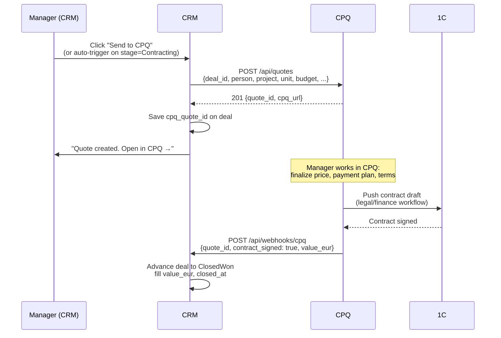

# Downstream

The CRM hands off to:
- **CPQ** for unit selection + price quoting + contract drafting *(integration deferred from v1)*
- **1C** (three instances: AVALON, BINA AGENCY, AVL EST) for legal contracts + payments *(no direct integration; via CPQ)*
- **BigQuery** for analytical aggregation *(active from v1)*

CRM doesn't write to 1C directly; CPQ does. CRM reads from CPQ; doesn't write.

## CPQ deferred from v1

User direction: drop CPQ integration scope until CPQ side is ready. Implications:
- Deals reach the `Contracting` stage and stay there until manually advanced to `ClosedWon`
- No automatic quote creation
- Unit inventory mirroring also deferred (see [domains/projects-and-units](../domains/projects-and-units))
- Deal's confirmed unit stays free-text (`deal_units.notes`) until CPQ integration phase
- Once CPQ team provides API details, this becomes a phase 8+ addition

## CPQ handoff

Trigger: Deal stage advances to `Contracting`. Manager has confirmed a unit (`deal_units` row with `role='confirmed'`).



### What CPQ exposes

→ See [open-questions](../open-questions) #14. We need to know what CPQ provides:
- POST endpoint to create a quote from a deal?
- Webhook on contract status changes?
- Read API for unit inventory? (for [domains/projects-and-units](../domains/projects-and-units))

If CPQ doesn't have any of these, fallback is **manual handoff**: manager copy-pastes deal info into CPQ, manually flips deal stage to Closed Won in CRM when contract signs. Suboptimal but unblocks the phasing.

### What we send to CPQ

```text
POST /api/quotes
{
  deal_id, person_id, project_id, confirmed_unit_id (if any),
  budget_eur_min, budget_eur_max,
  m2_min, m2_max,
  interested_real_estate_type,
  customer: {
    name, phone_e164, email_normalized, language,
    residence_country, current_country
  },
  source: { utm_source, utm_medium, utm_campaign, ... }
}
```

CPQ owns price, payment plan, contract drafting from there.

## 1C — read-only awareness

Three instances:
- AVALON
- BINA AGENCY
- AVL EST

Plus an "AVALON FIN..." (cut off in Miro) — likely AVALON Finance.

The CRM does NOT integrate with 1C directly. The path is CRM → CPQ → 1C. 1C is system of record for:

- Contracts (legal documents)
- Payment schedules
- Receivables
- Tax compliance

The only signal CRM gets from 1C is: **"contract X is signed"** — via CPQ's webhook, not 1C's direct webhook.

### Why not direct CRM ↔ 1C

- 1C is a proprietary ERP, integrations are typically painful and version-specific
- The legal/finance team owns 1C; we keep that boundary
- CPQ acts as the canonical bridge anyway (it's where the contract is composed)
- Three 1C instances would multiply the integration surface

If a specific signal is needed from 1C (e.g. payment received → unlock next contract milestone in CRM), we add a single signed webhook from 1C → CRM for that one event. No general-purpose sync.

## BigQuery — analytical event stream

The CRM emits a typed event stream that the analytical layer (`modern-data-stack/`) consumes. This **replaces** today's Fivetran 4×/day pull of Attio data plus the per-flow Fivetran webhook fan-out.

### Event shape

```ts
type CRMEvent = {
  event_id: uuid             // dedup key
  event_type: string         // 'activity.created', 'deal.stage_changed', 'task.completed', ...
  occurred_at: timestamptz   // event time
  emitted_at: timestamptz    // emission time (for diagnosing lag)
  payload: jsonb             // structured per event_type
  workspace_id: uuid
}
```

### Event types (initial set)

| Event | When | Key payload |
|---|---|---|
| `activity.created` | Inbound webhook processed | activity_id, kind, person_id, deal_id, utm_* |
| `interaction.logged` | Manager logs outbound | interaction_id, kind, deal_id, by_user_id |
| `person.created` | New Person resolved | person_id |
| `person.merged` | Async merge resolved | primary_id, merged_id |
| `deal.created` | New Deal | deal_id, project_id, source, stage |
| `deal.stage_changed` | Stage transition | deal_id, from, to, by_user_id |
| `deal.pipeline_state_changed` | active/stalled/deferred | deal_id, from, to |
| `deal.owner_assigned` | Routing | deal_id, owner_user_id, attempt_n |
| `deal.merged` | Deal merge | primary_id, merged_id |
| `task.created` | Sequence step / ad-hoc / gate | task_id, deal_id, template_id, due_at |
| `task.completed` | Done | task_id, disposition_id, outcome_id, completed_by |
| `task.overdue_warned` | Scanner ran | task_id, channel, warned_at |
| `routing.attempt` | Each assign/reroute | attempt_id, deal_id, user_id, expired_at |

### Transport

Today: Fivetran webhook endpoints (`https://webhooks.fivetran.com/webhooks/62e3b4da-...`). One per channel that ENSO already provisioned. We keep them.

CRM emits each event as `POST <fivetran_url>` with a JSON body. Fivetran lands the rows in BigQuery `raw_crm_events.events_*` tables, dbt staging takes over.

### Backfill

For migration: dump current Attio state once, transform to event-shape, post the stream to Fivetran for backfill. After cutover, only ongoing events flow.

### Why not direct BigQuery writes?

Fivetran's webhook → BigQuery has built-in schema evolution, batching, retry, dead-letter handling. Direct writes from CRM require us to handle all that. Fivetran already does it. No reason to leave.

## CPQ as also a read source for units

Per [domains/projects-and-units](../domains/projects-and-units), CRM mirrors CPQ's unit catalog lazily. If CPQ has a read API:

```text
GET /api/units?project_id=X&status=available
→ units[] with floor_plan_url, m2, bedrooms, list_price_eur, ...
```

— we sync hourly into `units` table. Reads in CRM hit our local cache; writes never go to CPQ.

## Boundaries summary

| Direction | Allowed |
|---|---|
| CRM → CPQ | Create quote on deal stage = Contracting |
| CPQ → CRM | Unit catalog read; webhook on contract status |
| CRM → 1C | **No** |
| 1C → CRM | One single webhook on key milestones (if needed) |
| CRM → BigQuery (via Fivetran) | All events |
| BigQuery → CRM | **No** (read-only data warehouse) |
| CRM → Customer.io | Track events for lifecycle |
| Customer.io → CRM | Email status webhooks |
| CRM → Chatwoot | Assignment, reply, custom attributes |
| Chatwoot → CRM | Conversation + message webhooks |
| CRM → Roistat | Push deal outcomes for revenue matching |
| Roistat → CRM | Call event webhooks |
