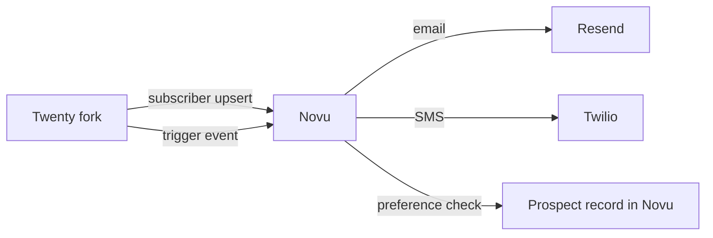

# External notifications · Novu

Prospect-facing notification delivery. **Twenty owns audience + behavior data.** Novu owns multichannel delivery + templates + provider routing.

## Why Novu (and not Customer.io)

- OSS (MIT), modifiable, **self-hosted on Railway** alongside Twenty + n8n
- Workflow editor + code-first option (`@novu/framework`)
- HTTP-triggered (`POST /v1/events/trigger`) — fits naturally with Twenty's event emission
- Multichannel from one API (email, SMS, push, in-app)
- Topics give us lightweight grouping (segments live in Twenty SQL)
- No marketing-DB-inside-the-tool — separation of concerns matches our architecture

## Hosting

Self-hosted on Railway. Requires:
- Postgres (shared with Twenty or separate database in same instance)
- Redis (shared with Twenty's instance)
- **MongoDB** (Novu's only awkward dependency — extra Railway service)
- S3-compatible storage for attachments (Backblaze B2)

## Direction of flow



Twenty triggers events into Novu by event name. Novu's workflow (configured in their UI or as code) handles delays, branching, channel routing, template rendering.

## Subscriber model

Each Person in Twenty maps to a Subscriber in Novu, keyed by `person_id`:

```
POST /v1/subscribers
{
  "subscriberId": "<twenty person UUID>",
  "email": "...",
  "phone": "+373...",
  "firstName": "...",
  "lastName": "...",
  "locale": "ro" | "ru" | "en",
  "data": {
    "language": "ro",
    "first_project": "ARTIMA",
    "current_country": "MD"
  }
}
```

Subscriber upserts happen via a Twenty NestJS event listener: on `person.created`, `person.merged`, `person.contact_updated` → push to Novu.

## Events fired into Novu

| Twenty event | Novu workflow | Channels |
|---|---|---|
| `deal.created` | `lead-welcome` | Email |
| `deal.stage_changed` to `Connected` | `connected-followup` | Email |
| `deal.stage_changed` to `Demo` | `demo-scheduled` | Email + SMS |
| `task.demo_held` | `post-demo-followup` | Email |
| `deal.stage_changed` to `Contracting` | `contracting-paperwork` | Email |
| `deal.stage_changed` to `ClosedWon` | `congratulations` | Email + SMS |
| `task.callback_scheduled` | `callback-reminder` | SMS |
| Sequence: stalled lead | `re-engagement-drip` | Email cadence (Day 1 / +3d / +7d) |

Implementation: Twenty's `notifications-external` NestJS module listens to domain events and posts to Novu. Idempotency via Twenty's own event ID as the Novu `transactionId`.

## Lifecycle cadences — deferred from v1

The drip cadences that exist in Customer.io today are **out of scope for v1.** User direction: build the infrastructure (Novu self-hosted, workflows runtime, subscriber sync), no specific cadences wired until after the rebuild stabilizes. The catalog gets built once we map the existing cadences post-launch.

Pattern (when added later) — Novu workflows with delay steps:

```yaml
# Example workflow definition (code-first via @novu/framework)
workflow('re-engagement-drip', async ({ step, payload }) => {
  await step.email('day-1', () => ({
    to: payload.subscriber,
    subject: 'Thanks for your interest in ' + payload.project_name,
    body: templates.welcome(payload),
  }));

  await step.delay('wait-3-days', { amount: 3, unit: 'days' });

  await step.email('day-4', () => ({
    to: payload.subscriber,
    subject: 'Floor plans for ' + payload.project_name,
    body: templates.floor_plans(payload),
  }));

  await step.delay('wait-7-days', { amount: 7, unit: 'days' });

  await step.email('day-11', () => ({
    to: payload.subscriber,
    subject: 'Still considering ' + payload.project_name + '?',
    body: templates.followup(payload),
  }));
});
```

Workflows version-controlled in Twenty's repo. Updates deploy with the application.

## Topics (lightweight grouping)

Used for ad-hoc broadcast to a set of prospects without full segmentation:

- `topic:project-artima` — all prospects interested in ARTIMA
- `topic:stage-deep-qualification` — all prospects in Deep Qualification stage
- `topic:brand-vanzari-imobiliare` — all Vanzari prospects

Subscriber-to-topic membership written by a Twenty cron job that queries our DB and reconciles Novu topics. Daily sync is enough; near-real-time only for the few topics that drive immediate events.

```sql
-- Example query feeding 'topic:stage-deep-qualification'
SELECT p.id FROM people p
JOIN deals d ON d.person_id = p.id
WHERE d.stage = 'DeepQualification'
  AND d.pipeline_state = 'active'
  AND p.merged_into_id IS NULL;
```

## Behavioral segmentation lives in Twenty

Full behavioral segments ("prospects who clicked our last email but haven't replied", "prospects who toured a unit but haven't been called back in 7 days") are SQL queries against Twenty. The result feeds into Novu topics or into specific workflow triggers.

The principle: **Twenty owns who's in segment X; Novu owns how segment X gets a message.**

## Email + SMS providers

Configured in Novu's provider settings:

| Channel | Provider | Why |
|---|---|---|
| Email | Resend | Sops uses it; team familiar; deliverability is good for transactional |
| SMS | Twilio | Global, has MD/RO numbers, mature |
| WhatsApp | (deferred — Chatwoot handles conversational; lifecycle WhatsApp via Novu only if needed) | |

Provider rotation is config-only — swap Resend for SES without changing application code.

## Self-host from day 1

User direction: self-host. Reasons:
- Modify Novu's source if needed (workflow runtime, providers, templates)
- No vendor lock-in
- Same ops surface as the rest of the stack (Railway)
- Data + recipient identifiers stay in our perimeter

Trade-off: MongoDB on Railway as an extra service. Acceptable.

## What we don't do in Novu

- Behavioral event tracking (lives in PostHog + Twenty Activities)
- Audience-to-Facebook sync (lives in n8n)
- Subscriber lifecycle (lives in Twenty People)
- Marketing journey design tool (lives in Twenty's sequences module)
- Lead scoring (lives in Twenty — computed view if we add it)

Novu is delivery infrastructure for events Twenty owns.
