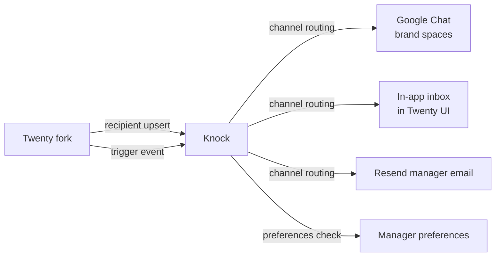

# Internal notifications · Knock

Manager and ops-facing notification delivery. Same Knock setup as sops (team is already familiar with the SDK + UI).

## Why Knock (and not Novu)

Different audience requirements:

| Need | Manager-facing reality |
|---|---|
| In-app inbox (bell icon, threaded notifications) | Critical — managers live in this all day |
| Google Chat integration with brand-specific spaces | Critical — current alerts go to Google Chat |
| Daily digest email composition | Useful for ops |
| Preferences UI per user | Useful (manager can turn off some channels) |
| Reliability for "the deal is yours, claim now" | Critical — tight SLA, can't drop |
| Channel routing logic (in-app first, then Google Chat after 1min if not opened) | Nice to have |

Knock excels at all of these. Novu's in-app component is good but Knock's is more polished and the team already uses it in sops.

## Direction of flow



## Recipient model

Each manager + ops user in Twenty maps to a Knock recipient, keyed by `user_id`:

```
identify({
  id: <twenty user UUID>,
  email: ...,
  name: ...,
  google_chat_user_id: ...,  // for DM routing
  timezone: 'Europe/Chisinau',
  preferences: { ... }
})
```

Recipient upsert on `user.created`, `user.updated` in Twenty.

## Events fired into Knock

| Twenty event | Knock workflow | Channel(s) | Timing |
|---|---|---|---|
| `deal.routing.assigned` | `new-lead-assigned` | In-app + Google Chat brand space + DM to manager | Immediate |
| `deal.routing.unclaimed_after_3min` | `claim-timeout-reroute` | DM to ops | Immediate |
| `deal.routing.escalation` (5+ reroutes) | `routing-exhausted` | Ops channel + admin DM | Immediate |
| `task.overdue.tier_1` | `task-overdue` | In-app | At due time |
| `task.overdue.tier_2` (15 min past) | `task-overdue` | Google Chat DM | +15 min |
| `task.overdue.tier_3` (1 hour past) | `task-overdue-email` | Email | +1 hour |
| `task.overdue.tier_4` (24 hours past) | `task-escalation` | Ops + manager's manager | +24 hours |
| `deal.stage_changed` to `ClosedWon` | `won-celebration` | Brand Google Chat space | Immediate |
| `deal.stage_changed` to `ClosedLost` (high value) | `lost-review` | Ops | Immediate (if value > threshold) |
| `daily_digest.6am` | `morning-digest` | Email | Daily 6am local time |
| `chatwoot.message_received` (mention) | `chatwoot-mention` | In-app + brand space | Immediate |

## Channel-specific configuration

### In-app inbox

Embedded in Twenty's UI via Knock's React component:

```tsx
import { KnockProvider, NotificationFeed } from '@knocklabs/react'

// In Twenty's layout
<KnockProvider apiKey={knockKey} user={{ id: currentUser.id }}>
  <NotificationFeed feedId={knockFeedId} />
</KnockProvider>
```

Replaces the bell-icon + dropdown we'd otherwise have to build in Twenty.

### Google Chat per brand

Each `projects` row carries `google_chat_space_id`. Knock routes to that space based on the event payload's `project_id`:

```
trigger('new-lead-assigned', {
  recipients: [{ id: deal.owner_user_id }],
  data: {
    project_id: deal.project_id,
    google_chat_space_id: project.google_chat_space_id,
    deal_url: ..., deal_name: ..., prospect_phone: ...
  }
})
```

Knock workflow uses `data.google_chat_space_id` to route the in-channel message; a separate step sends a DM to the assigned manager.

### Email digest

Composed daily at 6am local time, summarizing:
- Your open deals + their pipeline state
- Tasks due today
- Overdue tasks
- Routing assignments overnight

Knock's digest feature batches notifications for a recipient over a time window into one email.

## Preferences UI

Knock provides a default preferences page; Twenty embeds it for managers to toggle:
- In-app on/off per workflow
- Email digest on/off
- Google Chat DM on/off (always on for team-space)
- Quiet hours (e.g. no DMs 22:00-08:00)

## Idempotency

Knock has per-event-key dedup. We pass Twenty's event ID as the Knock `cancellationKey` so re-triggering the same event (e.g. via worker retry) doesn't double-notify.

For overdue scanning, the underlying SLA scanner (in Twenty) already uses `task_warnings(task_id, channel)` UNIQUE — Knock only gets called for net-new warnings.

## What we don't do in Knock

- Prospect-facing email/SMS (Novu does this)
- Conversational messaging (Chatwoot does this)
- Cross-system orchestration (Trigger.dev does this)
- Storing notification preferences in Twenty (they live in Knock, mirrored to Twenty UI)

## Cost expectation

| Plan | Monthly events | Cost |
|---|---|---|
| Knock free tier | ≤ 10k events | $0 |
| Starter | ≤ 100k events | $X (TBD when we know our volume) |

ENSO's manager-facing event volume at current scale is well under 10k/month (3 managers × ~few dozen notifications/day each = ~5k/month). Free tier covers v1.
