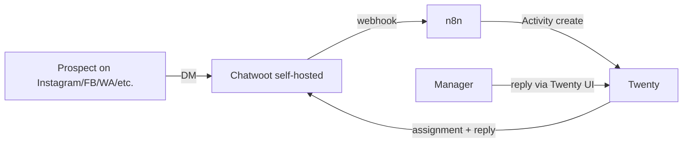

# Chatwoot

Self-hosted omnichannel inbox. Replaces Respond.io. Owned conversations across Instagram DM, Facebook Messenger, WhatsApp, Telegram, Viber, and webchat.

Notifications (email, SMS, in-app) go through [Novu](./external-notifications) and [Knock](./internal-notifications), not Chatwoot.

## Direction of integration

## Inbound: Chatwoot → CRM

Chatwoot fires webhooks on:
- `conversation_created`
- `message_created` (we filter for `message_type=incoming`)
- `message_updated`
- `conversation_status_changed`

Our n8n flow:
1. Receives the webhook
2. Maps the conversation's contact identifier (Instagram username, phone for WhatsApp, etc.) to our Person via Twenty's API
3. Creates an Activity (`kind=social_message`) in Twenty with `chatwoot_conversation_id` foreign key
4. Triggers Twenty's deal-resolution path (which decides whether to create a Deal or attach to an existing one)

Auth: Chatwoot API token in the n8n credential.

## Outbound: CRM → Chatwoot

When a manager works a deal in Twenty:

| Action in Twenty | Chatwoot API call |
|---|---|
| Reply to a prospect | `POST /api/v1/accounts/{account_id}/conversations/{conversation_id}/messages` |
| Assign the conversation to the deal's owner | `POST /conversations/{id}/assignments` |
| Add a label (e.g. "ARTIMA hot lead") | `POST /conversations/{id}/labels` |
| Update custom attribute linking to Twenty deal | `POST /conversations/{id}/custom_attributes` |

All called from Twenty's `chatwoot-integration` NestJS module (in our fork).

## What Chatwoot does NOT do for us

- It's not a CRM — Twenty owns Person/Deal identity
- It doesn't send marketing emails or SMS — Novu does
- It doesn't notify managers about overdue tasks — Knock does
- It doesn't observe call events — Roistat / Zadarma do

Chatwoot is **the inbox**. Period.

## Replacing Respond.io functionality

The existing Routing + Sequence Disposition n8n flows hit Respond.io APIs. Replacement endpoints:

| Today (Respond.io) | Replacement (Chatwoot) |
|---|---|
| `POST /v2/contact/{id}/conversation/assignee` | `POST /conversations/{id}/assignments` |
| `POST /v2/contact/create_or_update/id:{id}` with `attio_deal_link` custom field | `POST /conversations/{id}/custom_attributes` with `crm_deal_url` |
| Reading conversation history into deal context | `GET /conversations/{id}/messages` |

All of these moves into Twenty's `chatwoot-integration` module, called by the `deal-state-machine` and `routing` modules.

## Self-hosted operational notes

- Chatwoot needs its own Postgres + Redis (separate from Twenty's, or co-located but in different schemas)
- File attachments go to S3-compatible storage
- One inbox per channel + brand (e.g. "Instagram ARTIMA", "WhatsApp Vanzari Imobiliare")
- Brand-specific labeling so reports can filter by brand without manual tagging

## What about the AI bot chats?

Today's data shows "AI CHAT" / "Support AI" Activity records — auto-responder conversations interleaved with real prospect messages.

In the new architecture:
- AI bot lives in Chatwoot's conversation flow (Chatwoot supports webhook-based bot handoffs)
- Bot-only conversations create Activities with `is_synthetic=true`
- These do NOT trigger Deal creation or routing
- A manager can take over a bot conversation; the takeover moves the conversation to `is_synthetic=false` and triggers full routing

## Open questions specific to Chatwoot

- Inbox topology: one Chatwoot account with N inboxes per brand × channel, vs separate Chatwoot accounts per brand? My recommendation: one account, many inboxes. Cross-brand reporting easier.
- WhatsApp provider: 360dialog vs Twilio vs official Meta Cloud API? Affects template message workflow.
- Bot integration: which AI bot is "Support AI" today? Need to identify and decide if it carries over.
