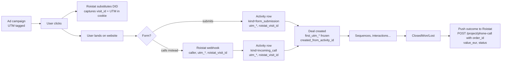

# Attribution

A deal that closes 6 months after first contact should still attribute revenue back to the originating campaign. That requires **first-touch UTM** preservation on the Deal — present in today's Attio schema and kept in the rebuild.

## The flow



## First-touch fields on Deal (frozen at creation)

```text
deals.first_utm_source
deals.first_utm_medium
deals.first_utm_campaign
deals.first_utm_content
deals.first_utm_term
deals.first_traffic_type           -- paid, organic, direct, social, email, referral
deals.first_landing_page
deals.first_referrer
deals.roistat_visit_id             -- the cross-call+web key
deals.first_contact_channel        -- call, email, sms, whatsapp, viber, telegram, social
deals.first_activity_id (fk → activities) -- pointer to the originating activity
```

Sourced from `deals.created_from_activity_id` at creation; immutable after.

If a later activity has different UTM (cross-channel re-engagement), it's logged on the activity but **doesn't update the Deal's first_***.

## Roistat visit_id — the cross-channel key

Roistat assigns a unique `visit_id` per website visitor cookie. When that visitor:

1. **Calls** — Roistat substitutes the DID in the website snippet, and the call webhook carries `visit_id` + UTM.
2. **Submits a form** — PostHog snippet (or direct form code) reads the Roistat cookie and posts `visit_id` along with the form data.
3. **Comes back days later** — Roistat keeps the cookie; subsequent activities reference the same `visit_id` if cookies survived.

→ We persist `roistat_visit_id` on activities AND on deals (frozen first-touch). PostHog also gets it as `distinctId` for analytical joining.

## Multi-touch / journey reconstruction

`activities` is the event log. For a Person, you can replay:

```sql
SELECT *
FROM activities
WHERE person_id = $1
ORDER BY occurred_at ASC;
```

— giving the full touch sequence (paid → organic → call → form → ...).

Cross-channel attribution models live in dbt downstream:

- **First-touch** — uses `deals.first_utm_*` directly (current model)
- **Last-touch** — `(SELECT utm_* FROM activities ORDER BY occurred_at DESC LIMIT 1)` per deal
- **Linear / time-decay** — weighted SUM across all activities per deal
- **Self-reported source** — `deals.first_contact_channel` for "what channel did they actually use to reach us"

The CRM emits the raw event stream; the analytical layer chooses the model. No need to commit to one in the operational schema.

## Pushing outcomes back to Roistat

When a Deal closes, push to Roistat for ROI matching:

```
POST https://cloud.roistat.com/api/v1/project/phone-call?project=12345
Headers: Api-key: <secret>
Body: {
  caller: deal.person.phone_e164,
  callee: deal.first_activity.callee_did,
  duration: deal.first_activity.duration_s,
  status: 'ANSWER',
  visit_id: deal.roistat_visit_id,
  order_id: deal.id,
  custom_fields: {
    project_id: deal.project_id,
    stage: deal.stage,
    value_eur: deal.value_eur,
    closed_at: deal.closed_at
  }
}
```

This closes the loop. Roistat dashboards then show revenue attributed per campaign / source / UTM.

Today: this isn't done explicitly. The analytical side (BigQuery + Lightdash) has the data but Roistat itself doesn't know which calls turned into revenue. Pushing back unlocks better in-Roistat reporting.

## PostHog event emission

For each Activity / stage transition / closure, emit to PostHog:

```ts
posthog.capture({
  distinctId: deal.roistat_visit_id ?? deal.person.phone_e164,
  event: 'crm.deal.stage_changed',
  properties: {
    deal_id, project_id, from_stage, to_stage,
    utm_source: deal.first_utm_source, ...,
    person_id, phone_e164
  }
})
```

This replaces today's per-project PostHog fan-out in `Calls Workflow for Attio` (which already does `Incoming Call`, `Identity`, `Alias` per brand). One central event stream from CRM → PostHog, not per-brand branches.

Identity aliasing: link `roistat_visit_id` ↔ `person_id` via `posthog.alias()` so web events and CRM events join in PostHog's identity graph.

## What today does well — keep

- First-UTM preservation on Deal
- `roistat_visit_id` (currently `roistat_param_1`) flowing through to PostHog
- Per-project PostHog distinctId scoping

## What today does poorly — fix

- UTM fields as plain text without enum validation → free-form values like `parcare_subterana` for `utm_source` get through. Rebuild: allow free text but normalize at intake.
- No outcome push back to Roistat (revenue not in Roistat dashboards)
- PostHog fan-out duplicated per project as separate workflow branches → one event with `project_id` as property
