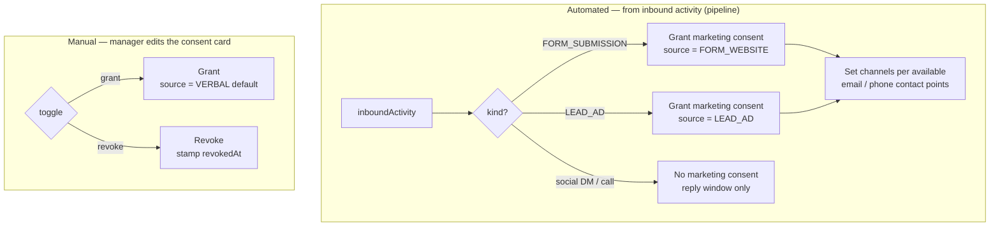

# Consent

**Status: Shipped.** Built CRM-side; the former n8n consent node is removed.

Marketing consent is tracked **per person, per project, per channel**. A contact who accepted Terms on an ARTIMA form has not consented to AVENEW marketing — consent does not leak across projects. The CRM is the system of record: consent is established automatically from inbound activity, edited manually by managers, and every grant/revoke keeps an audit trail of **how and when** it was obtained.

## The model

`personProjectConsent` is a junction object — one row per `(person, project)` pair — carrying consent for **four channels**:

| Channel | Granted when the person has… |
|---|---|
| `email` | a primary email |
| `sms` | a primary phone |
| `whatsapp` | a primary phone |
| `call` (outbound marketing call) | a primary phone |

Each channel has four fields (so `email…`, `sms…`, `whatsapp…`, `call…`):

```text
{channel}MarketingConsent          -- boolean: currently granted?
{channel}MarketingConsentSource    -- FORM_WEBSITE | LEAD_AD | VERBAL
{channel}MarketingConsentedAt      -- when consent was first obtained
{channel}MarketingConsentRevokedAt -- when revoked (null = active)
```

The row also carries a composite `name` (`<person> · <project>`, materialized on write — see [junction-composite-name-pattern](./junction-composite-name-pattern)) and the standard `createdBy` / `updatedBy` actor fields.

## How consent is established



### Automated (form intake)

`ConsentFromActivityService` runs inside the lead pipeline (alongside opportunity resolution and first-touch attribution, in `resolve-opportunity-from-activity.job`). Only **form-type inbounds carry Terms + Privacy acceptance**, so only they grant marketing consent:

- `FORM_SUBMISSION` → source `FORM_WEBSITE`
- `LEAD_AD` → source `LEAD_AD`
- **Anything else (social DM, inbound call) grants no marketing consent** — see [reply window vs marketing](#reply-window-vs-marketing) below.

On a qualifying activity it sets every channel the person can actually be reached on: `email` if there's an email; `sms` / `whatsapp` / `call` if there's a phone. `consentedAt` is the activity's `occurredAt`. Synthetic/test activities are skipped, and it is **best-effort** — a consent failure never fails the pipeline.

### Manual (the manager card)

When a human grants a channel through the API/UI, `PersonProjectConsentAuditService` stamps the audit fields:

- **First-ever grant** → source defaults to `VERBAL` (the "they told us in conversation" case, e.g. *"call me at this number"*), `consentedAt` = now.
- **Revoke** → `revokedAt` = now; the original source and `consentedAt` are **kept** as the historical record.

## Provenance preservation (the re-grant policy)

A channel that was **ever** consented (a real `consentedAt` exists) and is re-granted only has its `revokedAt` cleared — the original `source` and `consentedAt` are **never overwritten**. So a form consent (`FORM_WEBSITE` + the form's date) that is toggled off and on again keeps its FORM provenance, not a fresh `VERBAL` stamp. This protects the strongest evidence of consent.

The two paths don't collide: the pipeline writes via the raw workspace ORM (bypassing query hooks), so the audit service only ever fires for **manual** edits.

## Reply window vs marketing

Receiving a Facebook/Instagram DM or an inbound call opens a **service/reply window** — we may answer that conversation — but it is **not** marketing consent. Those channels are deliberately excluded from automated grants. Outbound marketing on SMS/WhatsApp/email/call requires an explicit consent record (form-derived or a manager-recorded VERBAL grant). See [social-intake](../integrations/social-intake) and [messaging](../integrations/messaging).

## The manager consent card

The Person record shows a **consent card** (`PersonConsentCard`) listing the four channels with their state — granted/revoked, source label, and date. It is **read-only by default** (a stray click must not change consent): clicking a channel grants it (keeping any existing form consent), and revoking prompts a confirm because it records an opt-out.

## Code

- `modules/enso/lead-pipeline/services/consent-from-activity.service.ts` — automated grants from intake
- `modules/enso/person-project-consent/services/person-project-consent-audit.service.ts` — VERBAL grant / revoke / provenance stamps
- `modules/enso/person-project-consent/query-hooks/*` — create/update pre-query hooks wiring name + audit
- `modules/enso/person-project-consent/services/person-project-consent-name.service.ts` — composite `name`
- `twenty-front/.../iframe/components/PersonConsentCard.tsx` — the manager card
