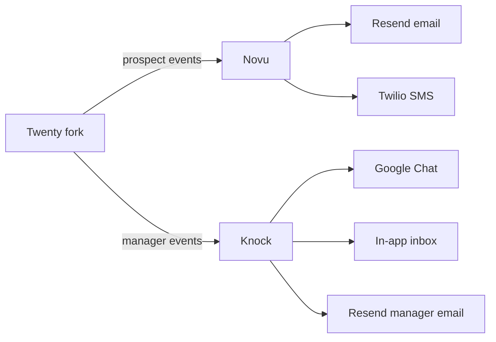

# Notifications

Two audiences, two tools. This page is the architectural overview; tool-specific details live in:

- [integrations/external-notifications](../integrations/external-notifications) — Novu (prospect-facing)
- [integrations/internal-notifications](../integrations/internal-notifications) — Knock (manager-facing)

## The split



**Prospect-facing** notifications go to Novu. Email confirmations, SMS reminders, drip cadences, lifecycle nudges.

**Manager-facing** notifications go to Knock. In-app inbox, Google Chat alerts per brand, daily digest emails, overdue warnings.

Each tool ships into its strength; neither carries the compromise of doing both.

## Source of truth

**Audience + behavior lives in Twenty.** Both Novu and Knock get subscriber/recipient upserts from Twenty's domain events. Neither has its own marketing DB. Segments are SQL queries against Twenty that materialize into Novu Topics or Knock recipient lists.

## Idempotency

Every notification trigger carries an idempotency key derived from the originating Twenty event ID. Re-firing the same event (e.g. worker retry) doesn't duplicate.

For overdue task warnings:
```text
task_warnings (task_id, channel)  -- UNIQUE constraint
```

The SLA scanner inserts with `ON CONFLICT DO NOTHING`; only RETURNING'd rows trigger downstream. See [systems/sla](./sla).

## Channel routing rules

Per audience:

| Audience | First channel | Escalation chain |
|---|---|---|
| Prospect | Email (immediate) | SMS after 24h if email not opened (Novu workflow logic) |
| Manager | In-app (immediate) | Google Chat DM after 15 min if not opened, escalation to ops after 24h |

Specific event-to-channel mapping lives in the Novu / Knock workflow definitions, version-controlled in their respective config.

## What lives where (cross-tool)

| Concern | Tool | Notes |
|---|---|---|
| Lifecycle drip cadence | Novu | Day 1 / +3d / +7d email sequence per project + stage |
| Demo confirmation | Novu | Email + SMS to prospect |
| Stage change → prospect email | Novu | Templated per stage + project |
| New lead in Routing | Knock | In-app + brand Google Chat + manager DM |
| Task overdue | Knock | Tiered: in-app → DM → email → ops escalation |
| Daily digest | Knock | Email composed from manager's open deals + tasks |
| Routing reroute warning | Knock | DM to manager and ops |
| Deal closed Won team announcement | Knock | Brand Google Chat space |
| Chatwoot @mention | Knock | In-app + brand Google Chat |
| Audience-to-Facebook | Neither — n8n cron job | Push to Facebook Marketing API, not a notification |

## What we don't do here

- No abstraction interface around Novu + Knock. Twenty's `notifications-external` module calls Novu directly; `notifications-internal` calls Knock directly. Two call sites is not an abstraction. Add a layer only if we need a third channel.
- No notification preferences stored in Twenty (each tool owns its preferences UI; Twenty's settings page embeds them).
- No notification storage in Twenty (notifications are events, not records).
