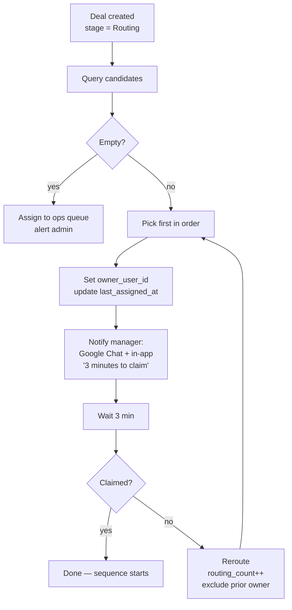

# Routing

Replaces `Routing Automation` (38 nodes) + `Distribution of Deals` (24 nodes) + the orphan call-routing flows.

## The algorithm



## Candidate query

```sql
SELECT u.*, u.last_assigned_at, vcc.active_clients_count
FROM users u
JOIN user_projects up ON up.user_id = u.id
LEFT JOIN user_active_clients_count vcc ON vcc.owner_user_id = u.id
WHERE u.role = 'sales_manager'
  AND u.available = true
  AND u.deactivated_at IS NULL
  AND up.project_id = $1  -- deal.project_id
  AND u.id != ALL($2)     -- excluded users from prior reroutes
ORDER BY
  COALESCE(u.last_assigned_at, 'epoch') ASC,
  COALESCE(vcc.active_clients_count, 0) ASC,
  RANDOM()
LIMIT 1;
```

This implements **true round-robin** (oldest `last_assigned_at` first), with `active_clients_count` as secondary fairness, with `RANDOM()` as tiebreaker.

Today's logic does a `Math.random()` pick from the full available pool — wasteful and unfair. The rebuild orders properly so a manager who hasn't been assigned in 3 hours gets the next deal.

## Claim window

After assignment:
1. Schedule a `claim_check_deal` job for `now() + 3 min`.
2. When it fires:
   - If `deals.stage != 'Routing'` → manager claimed it → done.
   - Else → trigger reroute.

Storage:
```text
routing_attempts
├── id, deal_id, user_id, assigned_at, expired_at, claimed_at (nullable), rerouted_at (nullable)
└── -- audit trail of every attempt
```

The job is idempotent — multiple firings produce one outcome.

## Reroute

Same algorithm with `excluded_users` accumulating the previously-assigned ones. `routing_count++` on the Deal. If candidates list becomes empty after exclusions → fall back to *any* available manager regardless of project (last resort, with admin alert).

If `routing_count >= 5` → escalation: mark Deal `pipeline_state = stalled`, post to ops Google Chat: *"Deal X cannot be routed — 5 attempts."*

## What "claimed" means

Today's signal: manager changes `stage` from Routing → Lead Claimed manually. The rebuild offers two paths:

**Auto-claim on first action** (recommended):
- Manager opens the deal in UI → server logs view event → claim
- Manager makes any change to deal fields → claim
- Manager creates an interaction (calls back) → claim

**Manual claim** (fallback):
- Big "Claim" button on the Routing page.

Either way, claim sets `stage = 'LeadClaimed'`, writes `timestamp_lead_claimed = now()` (in `deal_state_history`), and cancels the pending reroute job.

## Project specialization

Today's data: all 3 active managers are assigned to all 5 projects. So routing effectively ignores `project`. The rebuild keeps the project filter — when the team scales to 4-20 SDRs, project specialization becomes meaningful.

When AVENEW BOTANICA is added to the project list (today orphaned, see [open-questions](../open-questions) #5), managers explicitly opt into it via `user_projects`. ENSO LIVING gets the same treatment.

## Edge cases handled

| Case | Behavior |
|---|---|
| All managers offline | Deal stays in Routing, no assignment, ops alert posted, eventual auto-reroute when someone available |
| Single manager available, won't claim | Same person keeps getting rerouted; after 5 attempts → stalled + admin alert |
| Deal has no project (legacy AVENEW orphan during migration) | Fall back to any available `sales_manager` + admin warning |
| Manager goes offline mid-deal | Their existing deals stay assigned (don't get auto-reassigned); only NEW routing skips them |
| Manager deactivated | Their open deals migrate to ops queue for reassignment; admin notified |

## Click-to-call from routing

When a manager claims a deal sourced from a call (the original call missed), one-click triggers Zadarma callback API:
```
GET /v1/request/callback/?from={manager_sip}&to={caller_phone}
```
Logs an Interaction of `kind='outbound_call'`. The Zadarma signed-call mechanism (today in `zadarma-signer`) folds in as a backend service method.

## Roistat handoff

When a Roistat-attributed call comes in, the substituted DID maps to a Project (via `projects.roistat_phone_mapping` table, mirroring today's hardcoded mapping). That's how the deal's `project_id` is set at intake. Routing then finds project-assigned managers.

## What today does that we drop

- `Math.random()` pick from full pool (random unfairness)
- Imperative `active_clients_count++` on User (replaced by computed view)
- Comment-based notification ("Hello, you have 3 minutes...") — replaced by Google Chat + in-app push
- Deleting the comment after claim — gone, the audit lives in `routing_attempts`
- `Distribution of Deals` parallel workflow with disconnected branches — replaced by one clean routing service
