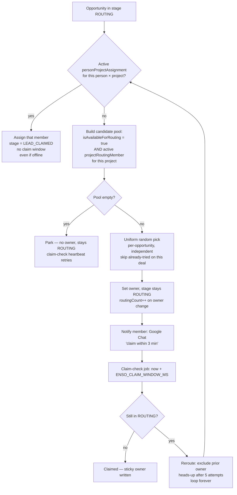

# Routing

Replaces `Routing Automation` (38 nodes) + `Distribution of Deals` (24 nodes) + the orphan call-routing flows.

**Status: Shipped.** Implemented in the lead-pipeline jobs + services (see [lead-pipeline](./lead-pipeline), [enso modules](../developers/enso-modules)). For a new opportunity in stage `ROUTING`: a **sticky owner** (the member who handled a prior deal for this person × project) auto-claims it straight to `LEAD_CLAIMED`; otherwise a member is picked **uniformly at random** from the project's online pool and gets a **3-minute claim window**; unclaimed deals **reroute forever**, **parking** (no owner) only while the whole project pool is offline.

> **Routing is NOT limited to a "sales manager" role.** Eligibility is purely: the member is *accepting leads* **and** is on the deal's *project routing pool*. The old `users.role = 'sales_manager'` gate is gone.

## Two member concepts (don't conflate them)

| Concept | Object | Who manages it | Purpose |
|---|---|---|---|
| **Accepting leads** | `workspaceMember.isAvailableForRouting` (boolean) | The member themselves | Online/offline switch — am I in *any* draw right now? |
| **Routing pool** | `projectRoutingMember` (junction: project × member, with `isActive`) | Admins (the "Routing Team" card on a Project, or the Routing Members table) | Which members can receive leads for *which* project |
| **Sticky owner** | `personProjectAssignment` (person × project → member, `endedAt IS NULL`) | Written automatically on claim | This member owns this customer for this project — future leads skip the pool |

A member receives a routed (non-sticky) lead only when they are **both** accepting leads **and** an active `projectRoutingMember` for that deal's project. Missing either one → they get nothing.

## The algorithm

## Candidate pool

The pick reads two objects and intersects them — no SQL role filter, no fairness ordering. From [`opportunity-routing.service.ts`](../developers/enso-modules) (`pickCandidate`):

1. `projectRoutingMember` where `projectId = deal.projectId` **AND** `isActive = true` → the set of eligible member ids.
2. `workspaceMember` where `isAvailableForRouting = true` → who's online.
3. Intersect (online ∩ project-eligible). Empty → return `no_candidates` (the deal parks).
4. Within the deal, prefer members not yet tried (`excludedManagerIds`, carried in the job payload — **not** stored); once all have been tried, reset and re-pick the full pool.
5. **Uniform random** draw: `pool[Math.floor(Math.random() * pool.length)]`.

The pick is **per-opportunity and independent**. There is **no** org-wide rotation counter, **no** least-recently-assigned ordering, **no** load balancing, **no** offline catch-up. Staying online keeps you in every draw (so the always-online get the most leads); going offline just drops you. What happens on one deal never influences another. The only reward for picking up is *structural*: you keep what you claim, and unclaimed deals reroute away from you.

## Sticky → auto-claim

Before the random pick, routing checks for an active `personProjectAssignment` (person × project, `endedAt IS NULL`). If one exists, the named member is assigned and the deal moves **straight to `LEAD_CLAIMED`** — no claim window, **even if that member is currently offline** (it's their client). See `findStickyManagerId` in the routing service.

Stickiness is *written* (not read) by the claim path — see [Claim → sticky](#claim--sticky) below.

## Claim window

After a non-sticky assignment, `RouteOpportunityJob` schedules a delayed `ClaimCheckJob` for `now + ENSO_CLAIM_WINDOW_MS` (default `180000` = 3 min). Idempotent job id: `enso-claim-check:<opportunityId>:<attempt>`.

When it fires (`ClaimCheckJob.handle`):
- Deal **left `ROUTING`** (claimed, or sticky auto-claimed) → **no-op**.
- Still in `ROUTING` → **reroute** (re-enqueue `RouteOpportunityJob` with the prior owner added to `excludedManagerIds`, `attempt + 1`).

No separate `routing_attempts` audit table — owner changes are captured natively in the deal Timeline / audit log (the workspace ORM emits an UPDATED event even on the routing service's system-context writes).

## Reroute — never gives up

- Reroutes **loop forever**. Routing **never hard-stops**. (The old "5 attempts → `STALLED`" escalation and `markStalled` were removed.)
- **Park + retry**: when the project pool is fully offline, `routeOpportunity` returns `no_candidates`; the deal parks in `ROUTING` with no owner and a claim-check heartbeat keeps retrying, so it resumes within one window of a member coming online. The only "stop" is everyone offline.
- **Admin heads-up** (not a stop): after `ADMIN_HEADSUP_AFTER_REROUTES` (= 5) unclaimed reroutes, a one-time ops Google Chat nudge fires (`ManagerNotificationService.notifyEscalation`); routing continues.

`routingCount` = number of **owner changes while in `ROUTING`**, first assignee = 1. Re-pinging the only-online member, or a parked cycle with no assignment, does **not** increment it (`nextRoutingCount`).

## What "claimed" means

A claim is **any update that leaves the deal out of `ROUTING` with an owner** — there's no dedicated "Claim" button or flag. In practice the member opens the deal and advances the stage (e.g. `ROUTING → LEAD_CLAIMED`).

The `opportunity.updateOne` POST hook (`OpportunityUpdateOnePostQueryHook`) fires on that update and:
- Writes the sticky `personProjectAssignment` (see below).
- Pushes the conversation assignment into Chatwoot so a social deal lands in the member's Chatwoot queue (`pushAssignmentOnClaim`, best-effort).

The pending claim-check job needs no explicit cancellation — it self-cancels (no-ops once `stage != ROUTING`).

## Claim → sticky

On claim, the POST hook calls `OpportunityClaimService.syncStickyAssignment`: upsert the active `personProjectAssignment` (person × project → owner). Written **on claim only**, never on tentative assignment, so stickiness reflects who actually handled the pair. Idempotent — no-op if already sticky to that member, repoints if the owner changed. The composite name comes from `PersonProjectAssignmentNameService`.

## Presence — self-service availability

`twenty-front` shows an always-visible **"Accepting leads / Not accepting leads"** toggle in the nav (`RoutingPresenceSection`). It flips the current member's `isAvailableForRouting` via the generic record hooks (`useFindOneRecord` / `useUpdateOneRecord` on `workspaceMember`). Members going offline are excluded from **new** routing; their **existing** deals are untouched.

## Project specialization

Today's data has the active members on all live projects, so project filtering is currently a near-passthrough — but it's a hard gate, not a heuristic. As the team scales (4–20 members) and orphan projects (AVENEW BOTANICA, ENSO LIVING) come online, admins add members to each project's Routing Team (`projectRoutingMember`) and routing narrows automatically.

## Notifications

Member + ops notices go out via Google Chat webhooks (`ManagerNotificationService`), all **best-effort** — a missing or failing webhook logs a WARN and never fails routing.

| Env (server **and** worker) | Used for |
|---|---|
| `ENSO_ROUTING_CHAT_WEBHOOK_URL` | per-assignment "claim within N min" notice; re-engagement ping |
| `ENSO_OPS_CHAT_WEBHOOK_URL` | escalation / no-candidate alerts (falls back to the routing webhook) |
| `ENSO_CRM_APP_URL` | base for clickable deal links in messages |
| `ENSO_CLAIM_WINDOW_MS` | claim-window override (default 180000) |

## Setting up a member for routing

1. **Add the member to the workspace** (normal invite). They default to *not accepting leads* — no role requirement.
2. **The member flips "Accepting leads" on** in the nav when they're working.
3. **An admin adds them to each project's Routing Team** (a `projectRoutingMember` row with `isActive = true`), repeated per project they should cover. A member on no project's pool receives nothing.
4. **(Optional) Sticky owner** — on a Person, an active Project Assignment (person × project → member) sends all future leads for that pair straight to that member, auto-claimed. Normally this is written automatically on the member's first claim, not by hand.

## Edge cases handled

| Case | Behavior |
|---|---|
| Whole project pool offline | Deal parks in `ROUTING` (no owner), heartbeat retries, resumes when someone comes online |
| Only one member online, won't claim | Reroute re-pings that same member each window; loops; heads-up after 5 |
| Sticky owner offline | Still auto-claimed — it's their client; no claim window |
| Member goes offline mid-deal | Existing deals stay assigned; only **new** routing skips them |
| Persistently unclaimed | One-time ops heads-up after 5 reroutes; routing keeps going |

## What today does that we drop

- **`role = 'sales_manager'` eligibility gate** — replaced by `isAvailableForRouting` + `projectRoutingMember` (any member can route).
- **`Math.random()` over the *full* pool** — now random over the *project-eligible online* pool, with per-deal rotation-without-replacement.
- **True round-robin via `last_assigned_at`** — *never shipped*; `lastAssignedAt` was removed entirely. Selection is per-opportunity random with no shared state.
- **`active_clients_count` counter / view, soft caps** — not used in routing.
- **`routing_attempts` audit table** — owner changes live in the native Timeline / audit log.
- **5-attempt `STALLED` hard stop** — replaced by never-stop + a one-time admin heads-up.
- Comment-based "Hello, you have 3 minutes…" notification + its deletion — replaced by Google Chat.
- `Distribution of Deals` parallel workflow — folded into one routing service.
