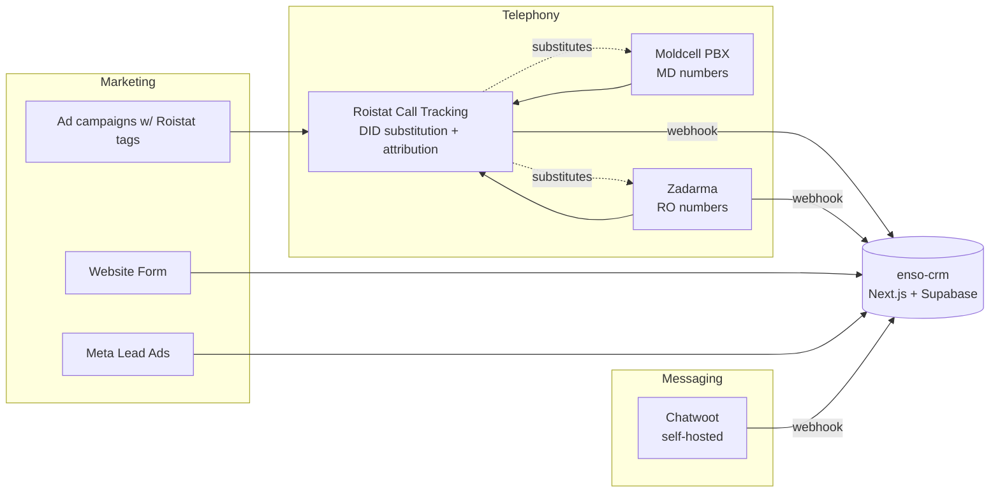

# Telephony & call-tracking — public API surface

What's reachable from outside Moldcell/Zadarma/Roistat, and what we'd have to glue ourselves. Used to scope the integrations chapter.

## Zadarma (RO numbers)

- **Auth**: HMAC-SHA1 over (method + sorted query + md5(query)), Base64'd. Header `Authorization: <user_key>:<sig>`. SDKs in PHP/C#/Python/TS — `zadarma-signer` already wraps this.
- **Base**: `https://api.zadarma.com/v1/`
- **Rate limits**: 100/min general, 3/min for `statistics`.
- **Webhook events**: `notify_start`, `notify_internal`, `notify_answer`, `notify_end`, `notify_out_start`, `notify_out_end`, `notify_record`, `notify_ivr` — covers the full call lifecycle.
- **Configure webhook**: `POST /v1/pbx/callinfo/url/` + `POST /v1/pbx/callinfo/notifications/`. **One URL per account.**
- **Webhook signature**: docs don't describe one. We'd verify by source IP + shared secret in URL.
- **Stats**: `/v1/statistics/`, `/v1/statistics/pbx/` (≤30d range, ≤1k rows/req).
- **Extensions**: `/v1/pbx/internal/`, `.../<sip>/info/`, `.../<sip>/status/`. (This is the `zadarma-signer`'s domain.)
- **DIDs**: `/v1/direct_numbers/...` — full CRUD.
- **Recordings**: `GET /v1/pbx/record/request/` returns signed time-limited download URL.
- **Click-to-call**: `GET /v1/request/callback/` (predicted dial supported).

→ **Verdict**: Mature API. The `zadarma-signer` Render service becomes a thin internal library call. No Render detour needed.

## Roistat (call-tracking + attribution)

- **Auth**: `Api-key: <key>` header + `?project=<id>` query.
- **Base**: `https://cloud.roistat.com/api/v1/`
- **Rate limits**: 10/sec, 5k/hour per project.
- **Webhook payload** (sent to one configurable URL):
  - Call: `id`, `caller`, `callee`, `duration`, `status` ∈ {ANSWER, BUSY, NOANSWER, CANCEL, CONGESTION}, `date`, `link` (recording URL).
  - Attribution: `visit_id`, `marker`, `google_client_id`, `landing_page`, `domain`, `referrer`, full UTM set, `source_level_1/2`, `roistat_param_1..5`, `first_visit`.
  - Visitor: `ip`, `city`, `country`.
  - CRM hooks: `order_id`, `custom_fields`.
- **Fires twice**: at call initiation **and** at call completion. We dedupe by `id`.
- **No signature** on outbound webhook. Verify by IP allowlist + a path-baked secret.
- **Push direction** (CRM → Roistat): `POST /project/phone-call` to inject calls; `POST /project/calltracking/call/list` to pull. Custom fields can carry our deal_id back into Roistat for ROI matching.
- **Scripts**: `POST /project/calltracking/script/{create,update,delete,list}` programs which DID substitutes for which campaign.

→ **Verdict**: Roistat is the **attribution layer** sitting in front of Zadarma/Moldcell. It owns the marketing→call linkage. Keep it. Our CRM ingests Roistat's webhook and uses `visit_id` / UTM as the attribution key.

## Moldcell Virtual PBX (MD numbers)

- **No public API**. Marketing page only. Admin happens in the operator-side cabinet.
- **Mobile app**: `md.moldcell.vats` (vats = ВАТС = "virtual PBX" in Russian).
- **Underlying platform**: not disclosed. Likely 3CX-skinned or proprietary Asterisk variant.
- **Customer admin URL today**: `binaagency.pbx.moldcell.md`.
- **No webhook**, **no programmable routing**, **no recording API** documented publicly.

→ **Verdict**: This is the **integration gap**. We can't directly observe call events from Moldcell. Three options:

1. **Roistat-as-proxy**: Roistat already substitutes the number in front of Moldcell DIDs and captures the call event (caller, status, recording link) regardless of where it terminates. So Roistat's webhook *is* our Moldcell event stream for marketing-tracked calls. ✅ Works today.
2. **SIP-side instrumentation**: Configure Moldcell PBX to fork to our SIP endpoint via dial-plan rule, so we get RTP/INVITE events. Heavy. Avoid unless required.
3. **Operator request**: Ask Moldcell whether they expose a partner API (3CX has Call Control API, BroadWorks has OCI). Worth a phone call — they list a corporate support line at 022 206 060.

→ **Default**: option 1. Moldcell PBX stays a black box; Roistat is the event source.

## Where this leaves the integration picture

→ **Roistat is the single funnel for telephony-attributed events.** Zadarma's direct webhook covers RO calls without Roistat tagging (e.g. PBX-internal). Moldcell observation is fully delegated to Roistat. Forms, Meta lead ads, and Chatwoot post to the CRM directly.
