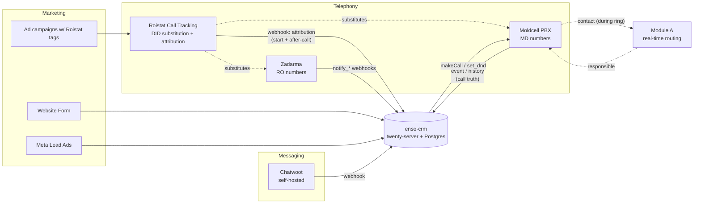

# Telephony & call-tracking — public API surface

What's reachable from outside Moldcell/Zadarma/Roistat, and what we'd have to glue ourselves. Used to scope the integrations chapter.

## Zadarma (RO numbers)

- **Auth**: HMAC-SHA1 over (method + sorted query + md5(query)), Base64'd. Header `Authorization: <user_key>:<sig>`. SDKs in PHP/C#/Python/TS — `zadarma-signer` already wraps this.
- **Base**: `https://api.zadarma.com/v1/`
- **Rate limits**: 100/min general, 3/min for `statistics`.
- **Webhook events**: `notify_start`, `notify_internal`, `notify_answer`, `notify_end`, `notify_out_start`, `notify_out_end`, `notify_record`, `notify_ivr` — covers the full call lifecycle.
- **Configure webhook**: `POST /v1/pbx/callinfo/url/` + `POST /v1/pbx/callinfo/notifications/`. **One URL per account.**
- **Webhook signature**: docs don't describe one. We'd verify by source IP + shared secret in URL.
- **Stats**: `/v1/statistics/`, `/v1/statistics/pbx/` (≤30d range, ≤1k rows/req).
- **Extensions**: `/v1/pbx/internal/`, `.../<sip>/info/`, `.../<sip>/status/`. (This is the `zadarma-signer`'s domain.)
- **DIDs**: `/v1/direct_numbers/...` — full CRUD.
- **Recordings**: `GET /v1/pbx/record/request/` returns signed time-limited download URL.
- **Click-to-call**: `GET /v1/request/callback/` (predicted dial supported).

→ **Verdict**: Mature API. The `zadarma-signer` Render service becomes a thin internal library call. No Render detour needed.

## Roistat (call-tracking + attribution)

- **Auth**: `Api-key: <key>` header + `?project=<id>` query.
- **Base**: `https://cloud.roistat.com/api/v1/`
- **Rate limits**: 10/sec, 5k/hour per project.
- **Webhook payload** (sent to one configurable URL):
  - Call: `id`, `caller`, `callee`, `duration`, `status` ∈ {ANSWER, BUSY, NOANSWER, CANCEL, CONGESTION}, `date`, `link` (recording URL).
  - Attribution: `visit_id`, `marker`, `google_client_id`, `landing_page`, `domain`, `referrer`, full UTM set, `source_level_1/2`, `roistat_param_1..5`, `first_visit`.
  - Visitor: `ip`, `city`, `country`.
  - CRM hooks: `order_id`, `custom_fields`.
- **Fires twice**: at call initiation **and** at call completion. We dedupe by `id`.
- **No signature** on outbound webhook. Verify by IP allowlist + a path-baked secret.
- **Push direction** (CRM → Roistat): `POST /project/phone-call` to inject calls; `POST /project/calltracking/call/list` to pull. Custom fields can carry our deal_id back into Roistat for ROI matching.
- **Scripts**: `POST /project/calltracking/script/{create,update,delete,list}` programs which DID substitutes for which campaign.

→ **Verdict**: Roistat is the **attribution layer** sitting in front of Zadarma/Moldcell. It owns the marketing→call linkage. Keep it. Our CRM ingests Roistat's webhook and uses `visit_id` / UTM as the attribution key.

## Moldcell Virtual PBX (MD numbers)

> **CORRECTED 2026-08-25.** This section previously stated Moldcell had no public
> API and concluded the PBX must stay a black box observed only via Roistat. That
> was **wrong**, and it is why real-time routing was considered impossible.
> Verified by downloading and reading the vendor spec. Canonical detail now lives
> in `content/docs/integrations/telephony.md`.

- **Full documented REST API.** Moldcell ВАТС is a white-labelled **ITooLabs Communications Server**.
- **Spec**: `https://itoolabstest.pbx.moldcell.md/media/admin/pdf/crm_rest_api.pdf` (17pp, RU only). Wiki: `https://wiki.pbx.moldcell.md/crm` (EN wiki is an empty stub).
- **Our tenant**: `enso.pbx.moldcell.md` (not `binaagency…` — that was a stale/other tenant). Endpoint `POST /sys/crm_api.wcgp`.
- **Auth**: HTTPS + one pre-shared token, bidirectional. CRM→PBX sends `token`; PBX→CRM pushes carry `crm_token`. No HMAC, no signing. Multiple API connectors per tenant, each with its own CRM address + token.
- **PBX → CRM pushes** (all to one URL per connector, dispatch on `cmd`):
  - `event` — real-time signalling: `INCOMING`/`ACCEPTED`/`COMPLETED`/`CANCELLED`/`OUTGOING`/`TRANSFERRED`, plus `direction`, `diversion`, and **`callid` stable across all legs**.
  - `history` — at hangup: `status` (`Success`/`Missed`/`Cancel`/`Busy`/`NotAvailable`/`NotAllowed`/`NotFound`), `duration`, **`link` = recording URL**.
  - `contact` — fires **while the phone is ringing**; we answer `{contact_name, responsible}` and the PBX can **auto-transfer to that manager** (enabled per number, with busy/no-answer fallback).
- **CRM → PBX**: `makeCall` (click-to-dial), `accounts`/`groups` (user mapping), `history` (CSV: `UID,type,client,account,via,start,wait,duration,record`), `subscribeOnCalls`/`set_dnd`/`get_dnd`/`subscriptionStatus`.
- Proven in practice: the legacy n8n stack already calls this API (`cmd=history`, `cmd=accounts`).

→ **Verdict**: Moldcell is the **call-truth source**, not a gap. It answers who is
ringing, who should take it, who did, and where the recording is. Roistat is
reduced to what only it knows: marketing attribution. Real-time routing is
achievable via `contact`; "who answered" needs no polling, it arrives on
`event ACCEPTED` / `history`.

→ **Superseded**: the old "Roistat-as-proxy / stay a black box" default. SIP-side
instrumentation and the operator partner-API phone call are both unnecessary.

## Where this leaves the integration picture

→ **Roistat and the PBX answer different questions.** Roistat is the funnel for
*attribution* (campaign, UTM, `project_id`) and fires twice — at call start and
at hangup. The **PBX is the source of call truth**: `event`/`history` push who
rang, who answered, duration, and the recording, keyed on a stable `callid`.
Moldcell observation is **no longer delegated to Roistat** — that was the
corrected mistake above.

→ **Two modules, deliberately separate.** Module A answers `contact` synchronously
while the phone rings and writes nothing; post-call ingest is asynchronous and
feeds the existing `inboundActivity` → routing pipeline. Zadarma is a second
provider on the same shape, not a special case — which is how RO finally gets
missed-call handling. Forms, Meta lead ads, and Chatwoot post to the CRM directly.

→ Note: the CRM is **twenty-server + Postgres** (the Twenty fork), not
Next.js + Supabase as an earlier draft of this diagram assumed.
