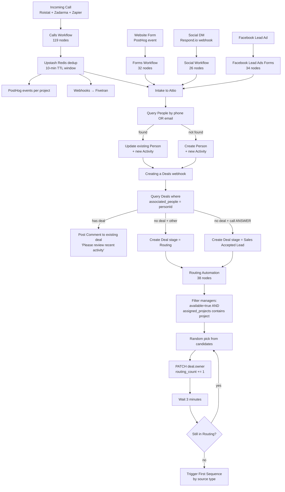

# n8n — actual intake + dedup + routing logic

What the workflows really do. Corrects my earlier hand-waves. Source: full JSON dump of every workflow walked node-by-node.

## The full lead path



## Person dedup — happens at intake AND after-the-fact

**Inline at intake (Forms/Social/FB):** before creating, query People by phone OR email:

```
POST /v2/objects/people/records/query
filter: { $or: [
  { phone_numbers: { $eq: '+' + props.phone } },
  { email_addresses: { $eq: props.email } }
] }
```

If hit → UPDATE that Person, attach the new Activity via `related_person_6`. If miss → CREATE Person.

**Phone normalization is shallow**: just `'+' + phone`, no E.164 cleanup. So `+37368012345` and `068012345` enter as different records. Worth fixing in rebuild.

**Async (`Merging Contacts`, 14 nodes):** triggered by Attio's record-update event on People where the changed attribute is `bab69178-627e-4c0a-803e-fcb4986fcbf0` (= `phone_numbers`). Re-queries People by phone+email, identifies the OLDEST existing contact as "main", merges multi-value fields (phone_numbers, associated_deals, associated_users, related_activity_5) as union sets, takes the main's scalar values, then **deletes the duplicate** and posts a Comment to the original manager. Read-only fields excluded from the merge: interaction fields, connection_strength, twitter_follower_count, etc.

## Deal dedup — query by associated_people, post comment if exists

`Creating a Deals` (22 nodes) does:

```
POST /v2/objects/deals/records/query
filter: { associated_people: { target_record_id: contact_record_id } }
```

If the Person has a Deal already, the workflow **does NOT create a new one** — it posts a Comment to the existing deal's manager saying "Please review the recent activity on deal X". So the user was right: **dedup happens upstream of Attio, before a duplicate deal can be created**.

If no existing deal → new Deal record:
- If source = "call" AND `incoming_call.body.status == "ANSWER"` → stage = **`Sales Accepted Lead`** *(NB: this stage was NOT in my schema pull — either it's a newly-added option or coerced to a fallback. Worth verifying live.)*
- Otherwise → stage = `Routing`
- `routing_count: "0"`, `timestamp_routing: <created_at>`, `pipeline_state: Active`

Then triggers downstream `Distribution of Deals` webhook (`8c1e211f-…`) — though most of that flow's downstream nodes are disconnected. The active routing path is `Routing Automation`.

## Routing algorithm (Routing Automation, 38 nodes)

Triggered by Attio webhook on `record.created` for a Deal:

1. Get Deal from Attio.
2. Branch on `stage`:
   - `Lead Claimed` → already owned, skip routing.
   - `Routing` → route now.
3. `POST /v2/objects/users/records/query` → all Users.
4. **Filter candidates**:
   ```js
   m.values.available?.[0]?.value === true
   && assigned_projects.some(p => name_or_id_matches(deal.initial_project))
   ```
5. **`Random Selection`** — `Math.random()` picks one from candidates. Not true round-robin (despite `last_assigned_at` existing). Excludes the admin email `vormanji@enso.ro`.
6. **PATCH deal**: `owner = selectedManager.email`, `routing_count += 1`.
7. **PATCH user**: `active_clients_count += 1`.
8. Post Comment to deal: "Hello {manager}, the deal {name} needs your attention. You have 3 minutes to start working on it."
9. **Wait 3 minutes.**
10. Re-fetch deal. If still `stage == Routing` (manager didn't claim): **re-route** — pick a different candidate, repeat. Delete the prior comment.
11. Once claimed, trigger the appropriate First Sequence workflow by source type:
    - `Call` → `ac7a9730-…`
    - `Social` → `1dba76d9-…`
    - `Form` → `6e1a5be8-…`

→ The 3-minute claim window + automatic reroute is real anti-stagnation behavior, and it explains why so many sample deals have `routing_count: 2` — the first manager didn't claim in time.

## Project list disagreement is patched by `Adding Project ID by Project Name` (17 nodes)

This workflow exists *only* because Attio doesn't auto-derive Project ID from Project Name. The mapping is hardcoded JS:

```js
const projectMapping = {
  "ARTIMA Business & Lifestyle":  { proposed: "9f9b7f71…", confirmed: "9269b278…" },
  "NEWTON HOUSE Buiucani":        { proposed: "2c0835a8…", confirmed: "ae8a9ca5…" },
  "AVRAM IANCU":                  { proposed: "a2023903…", confirmed: "f3bfd926…" },
  "Vanzari Imobiliare":           { proposed: "8f531d6e…", confirmed: "ebfe88d5…" },
  "ENSO LIVING":                  { proposed: "c85535ec…", confirmed: "648f8f85…" },
}
```

→ **AVENEW BOTANICA is NOT in this mapping.** So even with the patch, AVENEW deals can't have Proposed/Confirmed projects set. Confirmed orphan.

## Calls workflow internals (the dedup + cross-source merge layer)

`Calls Workflow for Attio` (119 nodes) receives events from **multiple sources for the same call**:
- `roistat_first` — Roistat at call start (visit_id, UTM, IP, geo)
- `roistat_second` — Roistat at call end (duration, status, recording)
- `zapier_first` / `zapier_second` — Zadarma → Zapier → here

→ **Zapier IS still in the path for Zadarma calls.** Direct counter-evidence to my earlier "no Zapier domains" claim — those events come into n8n with the source identified by payload key, not by referer domain.

**Dedup mechanism:**
1. Compute a `redisKey` from phone + timestamp window.
2. `Wait 3s`, then `GET https://golden-marmoset-28557.upstash.io/get/{redisKey}`.
3. **MERGE** old data (from Redis) + new event into one payload.
4. `SET /set/{redisKey}?ex=600` — 10-minute TTL.
5. Check "Is Ready to Send" — needs both start + end events to know status & duration.
6. Determine country: `callee.startsWith('40')` = RO, `'373'` = MD.
7. Fan out PostHog events per project: `Incoming Call`, `Identity`, `Alias` (mapping `roistat_param_1` ↔ phone), plus a duplicate `Incoming Call` event keyed on phone — for visit-attribution reconciliation in PostHog.

## Channel-specific intake flows

| Flow                     | Source                            | Project tagged from                          | Fan-outs                                                          |
|---                       |---                                |---                                           |---                                                                |
| Forms Workflow           | website form POST                 | `props.$host` (artima/newton/avenew/…)       | Attio Activity+Person+Deal · Google Chat per brand · Fivetran     |
| Facebook Lead Ads Forms  | Meta Lead Ads trigger             | form_id mapping                              | Attio · Google Chat · Fivetran                                    |
| Social Workflow          | Respond.io webhook                | Inbox attribution                            | Attio Activity+Person · Respond.io status update · Fivetran       |
| Calls Workflow           | Roistat + Zadarma                 | `roistat_second.custom_fields.project_id`    | Attio (via Creating-a-Deals) · PostHog events · Fivetran          |

All four push to **Fivetran webhooks** in addition to Attio — analytical events flow live, not just 4×/day pull.

All four post **Google Chat alerts** to brand-specific spaces (each brand has its own room + bot token in the URL — currently visible as plaintext URL fragments).

## What the intake architecture really teaches us about the rebuild

1. **Identity = phone (E.164). Period.** All four channels converge on phone as the dedup key. Email is secondary. Make `people.phone_e164` the unique-indexed primary lookup, with a phone-normalization function that accepts MD/RO partial numbers and adds the country prefix.

2. **Dedup window must be ≥ 10 minutes for calls.** Same call genuinely arrives 3-4 times (Roistat start + Roistat end + Zadarma webhook + maybe Zapier echo). Postgres `webhook_events(provider, external_id)` + a 10-min window grouping reproduces this without Redis.

3. **Deal creation is "deal-per-person-per-window, not deal-per-event."** The query-deals-by-person logic is the actual dedup rule for Deals. In Postgres this is a `SELECT … WHERE EXISTS (deal where associated_people = person_id)` before insert. Recommend a configurable cooldown (e.g. "don't create a new Deal if a Deal for this Person was created in the last 14 days") instead of "ever exists" — otherwise re-engaging old leads creates an awkward Comment-on-cold-deal experience.

4. **Routing is `available × project × random`, with a 3-min claim timeout and auto-reroute.** True round-robin (`last_assigned_at` ascending) would distribute more fairly. The 3-min claim timer is excellent and should survive.

5. **Project list is the single biggest schema mistake.** Five disagreeing surfaces + a hardcoded JS patch. In the rebuild this is one `projects(id, code, name, brand, active)` table, FK'd everywhere.

6. **Field-completion gating on stage transitions** is real logic worth porting. The `Tracking Deal Progress by Status` flow validates required fields per stage and rolls back if missing. This becomes a state-machine `canTransition` predicate.

7. **Cross-channel telemetry to PostHog/Fivetran is already in place.** The rebuild should preserve outbound event emission to keep the analytical side intact — don't tear down the analytical contract while replacing the operational core.

## Sample-level confirmations

Earlier hand-waves I corrected by reading the actual code:

| What I said earlier | Actual logic |
|---|---|
| "Attio creates a Deal per Activity" | False. Dedup happens before deal creation via `query deals where associated_people = personId`. |
| "Routing collapses to round-robin" | More accurate: filter by available + project, then **random pick**, plus 3-min claim-or-reroute. |
| "Stage doesn't auto-advance" | Partly false. `Tracking Deal Progress by Status` writes timestamps automatically AND validates required fields, **rolling back** if not filled. Stage advance is manual but enforced by validation. |
| "Sales Accepted Lead doesn't exist" | Workflow writes that stage value. Either it's a newly-added option or it gets coerced; live check needed. |
| "Zero Zapier presence" | Zapier IS in the call path (`zapier_first/zapier_second` event keys in Calls workflow). |
