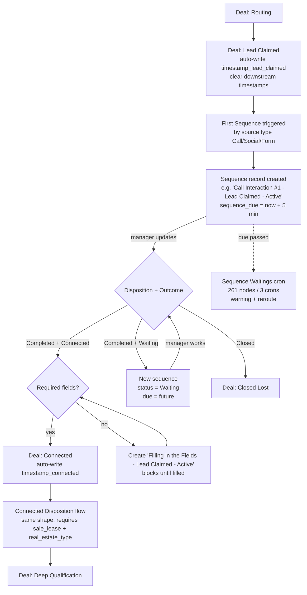
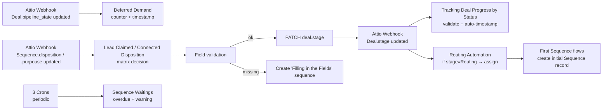

# n8n — Sequences engine, SLA, stage validation

The five workflows that encode the "Generate → Close" task automation, totaling ~770 nodes. This is **the** module to design well in the rebuild — it's where the doc says "the engine that dictates the next step" and where the biggest pain in any CRM lives.

## The flow at a glance

## The five workflows

| Workflow | Nodes | Role |
|---|---|---|
| First Sequence \| Lead Claimed | 24 | When stage → Lead Claimed, create initial sequence (`+5min` SLA) |
| First Sequence \| Connected | 24 | When stage → Connected, create initial sequence |
| Sequence \| Lead Claimed Disposition | 155 | Decision matrix on Disposition × Outcome at Lead Claimed |
| Sequence \| Connected Disposition | 139 | Same matrix at Connected |
| Sequence \| Waitings | 261 (3 crons) | Overdue / warning fan-out |
| (companion: Tracking Deal Progress by Status) | 91 | Auto-writes per-stage timestamps + field-validation gating |
| (companion: Deferred Demand) | 11 | Counter + timestamp for Active/Stalled/Deferred transitions |

## Sequence template naming convention (state machine states)

Every Sequence record's `sequence_name` follows: `<Channel> <Phase> #N | <Stage> | <Status>`

- **Channel** ∈ {`Social Interaction`, `Call Interaction`, `Form Interaction`} *(at Lead Claimed)* or {`Social Connected`, `Call Connected`, `Form Connected`} *(at Connected stage)*
- **N** = iteration count (#1, #2, …)
- **Stage** ∈ {Lead Claimed, Connected, Deep Qualification, Demo, Contracting, Closed Lost}
- **Status** ∈ {Active, Waiting} — drives `sequence_status` ({Today Tasks, Waiting, Done, Future Tasks})

Special non-positional template: **`Filling in the Fields | <Stage> | Active`** — the **field-completion gate**. Created when an Outcome=Connected sets out to advance the Deal but required fields are missing.

## Decision matrix — what each Disposition × Outcome does

Lead Claimed Disposition workflow has 18 IF nodes; 6 unique decision rules (×3 channels = 18). Distilled:

| Disposition | Outcome (`purpouse`) | Current `sequence_status` | What happens |
|---|---|---|---|
| Completed | Connected | Today Tasks | Validate `first_contact_7` + `first_contact_communication_channel_1`. If complete → advance Deal stage `Connected`, mark sequence `Done`. If missing → create `Filling in the Fields \| Lead Claimed \| Active` blocking task. |
| Completed | Connected | Waiting | Same as above. *(Connected reached on a follow-up rather than first touch.)* |
| Completed | Waiting | Today Tasks | Manager spoke but client said "wait." Create new sequence with `Status = Waiting`, `due = future`. *(Adds to follow-up queue.)* |
| Completed | Waiting | Waiting | Second wait. Escalation step — create another Waiting sequence further out. *(Lead Claimed flow only.)* |
| Completed | *(name contains "Closed")* | Today Tasks | Close deal as Lost. |
| Completed | *(filling-in template)* | Today Tasks | Field-completion gate satisfied → advance to next stage. |

Connected Disposition workflow mirrors the same matrix, with validation against `sale_lease_8` + `real_estate_type_3` to advance to Deep Qualification.

## SLA timing observed

| Where | Offset | Code |
|---|---|---|
| First touch after Lead Claimed | **+5 min** | `date.setMinutes(date.getMinutes() + 5)` in all three First Sequence flows |
| Routing claim window | **+3 min** | `wait` node in `Routing Automation` — reroutes if not claimed |
| Sequence dedup / call merge window | **+10 min** | Upstash Redis TTL `?ex=600` |
| Follow-up Waiting sequences | (varies, computed in JS — not extracted) | inside Lead Claimed/Connected Disposition flows |

Other SLA offsets are buried in code I didn't exhaustively pull. The pattern is consistent: `new Date(seq.created_at + offset)`, stored in `sequence_due_datetime`.

## Overdue / warning system (Sequence Waitings, 261 nodes, 3 cron triggers)

Three separate `scheduleTrigger` entries that periodically:
1. Query Sequences where `sequence_due_datetime < now()` AND `sequence_status ∈ {Today Tasks, Waiting}`.
2. Post a Comment to the Sequence record (and probably to the Deal manager).
3. Set the `warning_sent` text field.
4. Possibly create escalation sub-tasks.

**Idempotency problem**: `warning_sent` is a free-text field, not a typed flag with a uniqueness constraint. Without an idempotency key, multiple cron passes can re-warn the same sequence. The fact that the field is text (not boolean/timestamp) confirms the workflow leans on "is this string non-empty?" rather than a proper deduplication primitive.

→ In the rebuild: a `task_warnings(task_id, warned_at, channel)` table with `UNIQUE(task_id, channel)` makes idempotency a database-level guarantee instead of a JS-level inspection.

## Stage transition + field validation (Tracking Deal Progress by Status, 91 nodes)

Triggered by Attio webhook on Deal attribute-update where the changed attribute is `stage`. Per-stage logic:

| Transition | Action on advance | Required fields | If missing |
|---|---|---|---|
| → **Lead Claimed** | Write `timestamp_lead_claimed = now`. Clear: timestamp_connected, timestamp_deep_qualification, timestamp_demo, timestamp_contracting, timestamp_closed_won, timestamp_closed_lost. | (none — auto on owner assign) | — |
| → **Connected** | Write `timestamp_connected = now`. Clear: timestamp_deep_qualification, _demo, _contracting, _closed_won, _closed_lost. | `first_contact_7` (timestamp) AND `first_contact_communication_channel_1` (select) | **Roll back stage to Lead Claimed** (sets stage option `ec7c3534-…`), post a Comment to the deal manager: "You have not filled in the required fields..." |
| → **Deep Qualification** | Writes `timestamp_deep_qualification`. Clears: _demo, _contracting, _closed_won, _closed_lost. | `sale_lease_8` (select) AND `real_estate_type_3` (multi-select) | Roll back to Connected. |
| → **Demo / Contracting / Closed Won / Closed Lost** | Similar per-stage timestamp writes + downstream clears. Field requirements per stage (not fully extracted from 91 nodes). | (per-stage required fields) | Roll back. |

→ **The stage field is effectively a state machine with `canTransition()` predicates already implemented in n8n.** Porting this into the rebuild's domain code makes it testable and removes the 91-node workflow.

## Pipeline state lifecycle (Deferred Demand, 11 nodes)

Triggered by `pipeline_state` attribute change on Deal.

Switch on new value:
- → `Stalled`: `stall_count++`, write `timestamp_stalled`.
- → `Deferred`: `deferred_count++`, write `timestamp_deferred`.
- → `Active` (reactivation): `reactivated_count++`, write `timestamp_reactivated`.

All counters are text-typed in Attio → JS does `Number(value)` then `String(newValue)`. In Postgres: `BIGINT` counters or simply `SELECT COUNT(*) FROM deal_state_history WHERE deal_id = ? AND new_state = 'stalled'`. Counters are a view.

## Trigger fan-out diagram

## What this means for the rebuild

1. **Sequences are a state machine, not a record table.** Each Sequence record is one step in a per-Deal task chain. The "name" is the state (`Call Interaction #2 | Connected | Waiting` ≈ state `connected.waiting.iteration_2.call`). The "disposition + outcome" is the input event. The rebuild expresses this as TypeScript state machines (e.g. XState or a homegrown reducer) with task instances as the user-facing artifact.

2. **One state-machine engine + many templates.** Three channels × six stages × two statuses = ~36 named states today, each with timings and field validations. All of these are template-driven. In the rebuild a `sequence_template(id, channel, stage, iteration, default_due_offset_minutes, required_fields_to_advance, next_template_id_by_outcome)` table holds the definitions; instances are `tasks(id, deal_id, template_id, due_at, completed_at, disposition, outcome)` rows.

3. **The "Filling in the Fields" pattern is a separate concern from "follow-up sequences."** Don't mix them. In the rebuild, **stage validation** is enforced at the state-machine transition layer (returns "missing fields" before allowing advance, surfaces them in UI). **Follow-up tasks** are the user-creating-their-own-task path the user described — agent says "client wants a callback Friday" and a Task gets scheduled. Both coexist; neither is the other.

4. **Cron-based overdue scanning is fine but trivial.** A single `SELECT id FROM tasks WHERE due_at < now() AND completed_at IS NULL AND warned_at IS NULL` plus an idempotent warning insert replaces all 261 nodes of `Sequence Waitings`.

5. **Stage transitions get timestamps for free.** Don't store 11 different `timestamp_*` text fields. One `deal_state_history(deal_id, from_state, to_state, transitioned_at, transitioned_by, was_rollback)` table. Every "how long did this deal sit in stage X?" question is a window function.

6. **Disposition + Outcome should be FK'd, not free select.** Today: typo "Owerdue" exists in production options because the select is editable. In Postgres: `disposition_id` references a managed enum + per-template allowed-outcome list. Adding a new disposition is one row, not a workflow edit.

7. **Three channels currently have parallel logic.** Lead Claimed Disposition has 3 webhook entries (Social/Call/Form) and 3 IFs for each rule. Templates differ in description text and the channel-specific action (e.g. Call → "ring back", Social → "reply in Respond.io", Form → "first call out"). In the rebuild this is one engine with `channel` as a template attribute, not three parallel branches.

8. **Sequence effectiveness analytics is a real ask the user named.** With `tasks` as a proper table, "what % of `Call Interaction #1 | Lead Claimed | Active` end in Outcome=Connected within SLA?" is a SQL query. Today it would need a custom-built Lightdash exposure on top of the noisy text-field schema.
